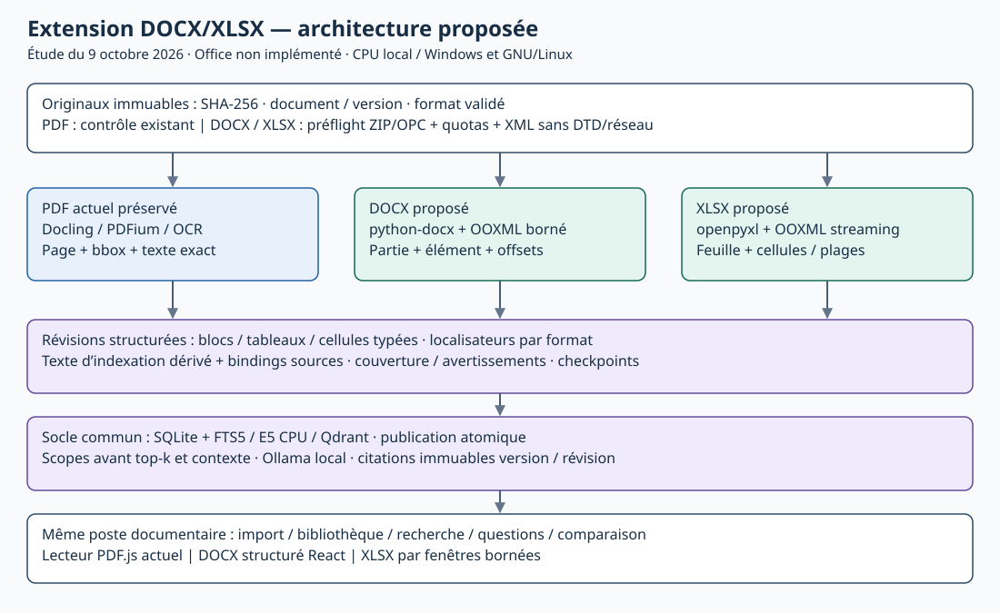

# Extension DOCX/XLSX — étude d'intégration

**Rôle :** étude et justification de l'extension, distinctes de son implémentation · **Propriétaire :** intégration documentaire · **Statut :** étude finalisée et relue indépendamment ; choix pour le plan, implémentation Office non commencée · **Référence :** `75df7600ba73283c3a77e6fa8244a2f1f82cf1cf` avec corrections R27 locales, le 9 octobre 2026 · **Date :** 2026-10-09 UTC · **Suivi canonique :** [PLAN, R28](../PLAN.md#r28--étude-de-lextension-docxxlsx-avant-implémentation).

## 1. Résultat et limites de l'étude

L'intégration proposée conserve le poste documentaire et la recherche RAG
existants. Elle ajoute deux adaptateurs natifs et deux lecteurs structurés,
avec des citations propres au format : élément DOCX ou cellules XLSX. Les
tableaux restent des données structurées ; leur représentation pour FTS/E5
est un dérivé borné, relié aux données originales.

La cible retenue pour le plan est **python-docx 1.2.0 avec un parcours OOXML
borné** pour DOCX, et **openpyxl 3.1.5 en lecture seule avec un complément
OOXML** pour XLSX. Ces bibliothèques sont déjà présentes dans le verrou
Docling ; leur usage direct devra être déclaré explicitement sans migration
de version. Docling reste le moteur PDF livré. Les lecteurs directs ne sont
pas considérés comme des adaptateurs Office complets déjà réalisés.
Le schéma de flux associé est une architecture **proposée**, pas un
diagramme du runtime Office actuel :

Le SVG est généré par [office_study_diagram.py](../tools/office_study_diagram.py)
depuis cette proposition d'étude ; il ne décrit pas une architecture Office
déjà implémentée.

La conception fonctionne sans GPU, service cloud, Microsoft Office ou
LibreOffice obligatoires. Elle vise Windows natif et GNU/Linux aarch64 et
x86-64 sous les prérequis du runtime existant, sans dépendance Jetson.
La qualification Windows est différée par l'utilisateur. Les mesures
ci-dessous sur un Jetson de 61 Gio ne prouvent ni les performances d'un
poste de 16 Go, ni toutes les distributions Linux.

**Exécuté :** inspection ciblée du code, sources mainteneur/version, 18 essais
de parseurs, contrôles d'oracle et six vérifications d'ancrage DOCX.
**Non exécuté :** ingestion Office dans l'application, migration d'une base
persistante, embeddings/recherche/RAG Office, lecteur Office, gros classeurs,
documents métier et recettes Windows/x86-64/16 Go. Aucune implémentation
produit Office n'est livrée par cette étude.

## 2. Architecture et frontières réellement rencontrées

| Composant actuel | Fait vérifié / fichier | Réutilisation et adaptation proposée |
|---|---|---|
| Import et versions | `services/api/db.py`, `main.py` : chemins `.pdf`, signature PDF, blobs originaux PDF ; SHA/version indépendants de l'index | Garder intégrité, déduplication, arborescence et versions ; autoriser le format après identification réelle du package OPC, avec MIME et extension du blob corrects. |
| Extraction | `services/ingestion/preflight.py`, `worker.py`, `pipeline.py`, `docling_adapter.py` : préflight PDFium, fenêtres de pages, sortie par pages et `item.prov` | Garder la voie PDF ; dispatch Office dans les jobs vers un sous-package dédié. Les DOCX sans `prov` seraient perdus et les coordonnées Excel seraient faussement traitées comme bboxes PDF. |
| Identité d'extraction | `services/ingestion/config.py:98–99` : hash de tous les `services/ingestion/*.py` | Ne pas ajouter les adaptateurs au même niveau ou modifier les fichiers PDF pour un dispatch Office. Nouvelle identité Office couvrant son code, ses options et ses dépendances ; changement réellement partagé = nouvelle identité assumée. |
| Données | Migrations `001` à `003`, schéma v3 : `blocks.page_index` et `chunk_sources.page_index` obligatoires, pages séparées ; `tables_data` JSON | Pas de pseudo-pages. Localisateurs typés, colonnes PDF nullables pour Office, stockage des unités et cellules ; conserver UUID, versions, générations, citations et données PDF. |
| Indexation | `services/api/indexing.py` : `extraction['pages']`, chunking par page/section, cible E5 320 tokens, recouvrement 48 et borne 448 | Garder cache des vecteurs et publication SQLite/Qdrant ; ajouter une projection Office structurée et une révision de chunker Office distincte. La révision PDF reste celle de sa voie inchangée. |
| Scope/retrieval/contexte | `scope.py`, `retrieval.py`, `context.py` : jointures pages, labels page+1, découpe par blocs/offsets | Réutiliser résolution autoritaire, fusion hybride, priorité des identifiants et token budgets ; appliquer sections/feuilles/plages avant top-k et recharger les seules cellules autorisées avant le contexte. |
| Citations | `query.py`, table `citations.source_json`, version/révision et liens query/source | Garder le registre immutable et les liens ; ajouter la localisation Office et des labels honnêtes, sans réécrire les citations PDF anciennes. |
| Poste web | `workspace.tsx`, `document-tools.tsx`, `types.ts`, `source-location.ts`, `scope-control.tsx` : accept PDF, lecteur PDF systématique, navigation pages/sections | Même bibliothèque, panneau d'analyse et session ; lecteurs propres au format, sélection versionnée et ouverture de citation à la bonne révision. |
| Import dossier CLI | `tools/corpus/import_folder.py:34–48` : suffixe PDF uniquement, transfert `application/pdf`, comptes PDF | Étendre le même outil aux formats validés sans changer son `--source` historique ni renommer le dossier utilisateur ; format/MIME et rapports doivent rester exacts. |

Les sondes backend ont appliqué le schéma courant à une base **en mémoire** :
DOCX/XLSX sont refusés par le validateur de chemin et `page_index=NULL` échoue.
Le SQLite exécuté est 3.53.1 ; `ALTER COLUMN DROP NOT NULL` y fonctionne.
Cela ne garantit pas que le SQLite de tous les Python 3.12 Windows/Linux
supporte cette syntaxe. La migration portable est prévue dans le plan,
sans relever silencieusement le minimum SQLite.

Portabilité vérifiée statiquement : python-docx, openpyxl, lxml, defusedxml
et et-xmlfile sont déjà verrouillés ; 12 roues officielles et leurs hashes
ont été confrontés à PyPI, dont lxml CPython 3.12 Windows AMD64 et GNU/Linux
aarch64/x86-64. Les parseurs Office n'exigent ni Jetson ni GPU. Les tags
manylinux et bibliothèques natives restent des prérequis du runtime ; le
bootstrap conserve son garde minimal glibc>=2.28, sans promesse musl/Alpine.
Un kit peut imposer un minimum plus élevé selon ses binaires et bibliothèques ;
son manifeste et sa recette restent les preuves de cette exigence effective.
L'existence d'une roue ne prouve ni sa présence dans chaque kit hors ligne,
ni une recette sur la plateforme concernée.

Le dépôt conserve SQLite autoritaire, Qdrant serveur loopback, FTS5,
E5-small ONNX INT8 sur CPU, Ollama local et export Next.js statique.
Aucune nouvelle base, aucun GraphRAG, agent runtime ou framework n'est
nécessaire pour cette extension.

## 3. Bibliothèques et solutions évaluées

| Solution | Fidélité / apport | Performance, maintenance et compatibilité | Choix pour cette extension |
|---|---|---|---|
| Docling 2.131.0 Office | Structure Word riche ; fusions et listes conservées sur des cas ; pas d'ancrage DOCX d'origine ; pertes de texte littéral, singleton, légende et métadonnées observées. Excel perd formules et types dans sa représentation. | Déjà installé, mais import froid charge PyTorch ; ~400 Mio sur petits fichiers. Un complément d'ancrage Word exigerait un second parcours et des raccords fragiles au modèle converti. | Conserver pour PDF ; témoin Office et référence de couverture, pas source canonique Office. |
| python-docx 1.2.0 + OOXML borné | API publique pour propriétés, styles, paragraphes/tableaux ; accès direct aux éléments originaux. Le parcours haut niveau seul manque révisions, notes et certaines structures. | ~33 Mio sur le fichier Word annoté. Pas de nouveau runtime ; complément ciblé et testé pour les éléments hors API. | Cible DOCX, avec contrat explicite de couverture et tests de hiérarchie/listes/notes/révisions. |
| openpyxl 3.1.5 read_only + OOXML borné | Cellules typées, adresses, formules/noms ; cache séparé. Tables/fusions/commentaires ne sont pas tous disponibles en streaming. | ~48 Mio pour deux lecteurs sur le petit classeur ; shared strings/styles peuvent croître. Lecture sparse bornée et métadonnées complémentaires nécessaires. | Cible XLSX ; aucun calcul des formules. |
| Calamine / python-calamine | Lecteur Rust, plages/formules/noms selon API mainteneur | Non installé/non mesuré ; couverture détaillée et roues Windows/aarch64 à qualifier | Alternative ciblée seulement si le candidat XLSX échoue au budget. |
| Mammoth / docx-preview | HTML sémantique ou aperçu DOCX | Pas d'ancrage source contractualisé ; HTML non fiable à contrôler ; nouveaux coûts côté client | Pas de dépendance initiale ; lecteur React depuis notre extraction canonique. |
| Microsoft MarkItDown | Conversion Word/Excel vers Markdown | Sortie utile pour lecture, insuffisante comme contrat de cellules/types/formules/localisateurs | Non retenu comme source de vérité. |
| Apache Tika / POI | Couverture Office et métadonnées | Runtime Java supplémentaire, aucun avantage local démontré pour les deux formats | Non retenu. |
| LibreOffice headless / Pandoc | Dérivés visuels/conversion ; LibreOffice peut recalculer | Runtime, polices, profils, sécurité et résultats de calcul distincts ; LibreOffice 6.4.7 présent ici, non qualifié comme dépendance portable | Pas requis. Un aperçu PDF éventuel reste un dérivé identifié ; jamais de recalcul implicite. |

Il s'agit d'un choix adapté aux contrats du dépôt, pas d'un classement
universel SOTA. Les scores PDF publiés et anciens benchmarks openpyxl ne
remplacent pas une mesure Office sur la stack verrouillée.

## 4. Benchmark réellement exécuté

Protocole du 9 octobre : un sous-processus froid par cas (**n=1**), Python
3.12.14, Linux aarch64/Jetson, exécution CPU et enrichissements désactivés, sans modèle
ni génération. Chaque cas est borné à 60 s et 4 Gio RSS ; les fichiers sûrs
seuls passent dans Docling. Les archives adverses restent hors conversion
non protégée. Le RSS maximal natif et l'échantillonnage du parent sont
conservés séparément ; la table emploie leur maximum pour éviter une
minoration. Les durées sont import et opération du probe, pas des p95 RAG.

| Fichier / lecture | Import (s) | Opération (s) | RSS max (Mio) | Résultat pertinent |
|---|---:|---:|---:|---|
| DOCX structuré, Docling | 8,771 | 0,230 | 404,79 | Converti ; 23 items sans provenance, table singleton aplatie et espaces inter-runs perdus. |
| Même DOCX, python-docx | 0,115 | 0,044 | 33,49 | Ordre, texte littéral, deux tables et propriétés conservés ; insertion sous `w:ins` absente du parcours public naïf. |
| XLSX formules/cache, Docling | 8,841 | 0,053 | 398,54 | Converti ; formules perdues, `25` et cache volontairement périmé `999` deviennent du texte. |
| Même XLSX, openpyxl normal, deux lectures | 0,322 | 0,027 | 45,56 | Types, formules/caches, table et fusion disponibles ; ne prouve pas l'échelle. |
| Même XLSX, read_only, deux lectures | 0,321 | 0,048 | 47,56 | Quatre formules, deux caches présents et deux absents distingués ; tables/fusions manquent dans cette API. |
| XLSX sans caches, read_only, deux lectures | 0,314 | 0,046 | 46,29 | Quatre formules conservées ; valeurs calculées absentes, sans valeur inventée. |
| DOCX officiel tableaux, Docling / direct | 9,090 / 0,113 | 0,168 / 0,038 | 399,42 / 29,85 | Deux lectures réussies ; comparaison de structures et limites conservée. |
| XLSX officiel cas limites, Docling / direct | 9,163 / 0,320 | 0,062 / 0,110 | 399,63 / 48,24 | Comparaison réelle ; probe direct explicitement limité aux coordonnées de l'oracle. |

Les 18 cas durent **105,08 s** au total : 14 lectures/conversions réussies
et quatre rejets attendus de fichiers corrompus (`ConversionError` ou
`BadZipFile`). Une conversion réussie n'est pas une réussite de fidélité.
Les originaux ont tous conservé leur SHA-256. Le premier passage rouge,
causé par le garde QA refusant la sonde Python locale `uname -p`, est gardé
séparément ; l'import corrigé autorise uniquement cette commande en lecture
seule et trace ses appels. Le namespace reste hors ligne, UID utilisateur,
capacités nulles ; aucune tentative socket/DNS n'a été capturée.

Corpus : six conteneurs synthétiques OOXML annotés, dont corruption et
dimensions erronées, et trois fichiers du dépôt officiel Docling v2.131.0
(Word tableaux, Excel cas limites, Word image externe). Ce sont de vrais
DOCX/XLSX avec manifestes SHA/parties/oracles ; ce ne sont pas des documents
métier représentatifs. Les droits du dépôt officiel et l'identité de chaque
fixture sont consignés ; leur contenu binaire n'est pas publié dans Git.

Une sonde complémentaire résout **six ancrages DOCX exacts** : paragraphes
identiques avec IDs distincts, espaces entre runs, table singleton et cellules
fusionnées. Deux lectures donnent les mêmes identités, hashes et offsets.
C'est une preuve de faisabilité sur le fixture, pas un adaptateur général.

Un quatrième exemple officiel, DOCX Strict de 11,9 Ko, a ensuite fait
l'objet d'un contrôle distinct, hors des 18 cas : `python-docx.Document()`
refuse sa relation Strict (`KeyError`), alors que la lecture XML bornée
de l'original réussit. La couche OOXML cible doit reconnaître **Strict et
Transitional**, y compris namespaces et relations ; python-docx seul n'est
pas une solution complète. Une éventuelle normalisation de compatibilité
est un dérivé déterministe, ancré à l'original, jamais une réécriture de
celui-ci. Cette branche reste à implémenter et qualifier.
XLSX Strict n'a pas été exécuté ; ce cas doit aussi figurer dans le gate de
compatibilité OOXML, sans annonce de prise en charge acquise.

Les faits discriminants sont dans `fidelity-results.json` : Docling conserve
les répétitions, insertions et fusions testées, mais pas tout le contrat
source ; la lecture publique directe conserve les littéraux, mais doit être
complétée pour les révisions. Les gros fichiers, reprises, usages RAG et
interfaces restent des mesures futures, explicitement `NOT_RUN`.
Le probe XLSX parcourt seulement les 8 lignes et 8/16 colonnes de ses
oracles et relit le cache via `ReadOnlyWorksheet.cell()` ; cette dernière
opération peut rescanner les lignes. Il n'est donc pas un prototype de
lecteur scalable ni un benchmark exhaustif des exemples officiels. La
lecture jointe streaming cible doit être mesurée séparément.

## 5. DOCX : extraction et lecture proposées

Le parcours canonique suit les éléments et relations OPC dans leur ordre
source. Il conserve texte exact, runs/tabulations/sauts utiles et offsets
Unicode ; le texte normalisé d'indexation porte une table de correspondance.
Ne pas identifier un paragraphe par son texte, son style affiché ou sa seule
position dans l'export Markdown.
Les deux familles de namespaces OOXML sont reconnues explicitement. Le
parcours source n'est pas remplacé par les seules listes publiques de
paragraphes/tables ; les helpers python-docx sont employés là où leur
contrat est valable. Tester la branche Strict avant d'annoncer le support.

| Structure | Traitement à réaliser / critère |
|---|---|
| Titres et sections | Résoudre styles hérités et `outlineLvl`, construire une hiérarchie stable par version ; garder titre et texte originaux, niveau absent explicite. |
| Listes et numérotation | `numId`/`ilvl`, abstractNum/overrides, redémarrages et formats ; label calculé dérivé séparé du texte source, sans confondre une liste avec un titre. |
| Paragraphes et champs | Lire hyperliens, champs et contenu affiché ; ne pas recalculer un champ. Révisions : vue de lecture finale déterministe proposée, insertions incluses/suppressions exclues, présence et contenu révisionnel conservés comme métadonnées consultables. |
| Tableaux | Grille réelle, cellules, `gridSpan`/`vMerge`, tables imbriquées et singleton ; ne pas dupliquer cellules fusionnées ni inférer automatiquement première ligne = en-tête. |
| Images, légendes | Blob/hash/type/dimensions, alt text et ancre ; rattacher une légende seulement si la relation/règle est démontrée, sinon garder légende et figure distinctes. Pas d'interprétation VLM/OCR implicite. |
| Notes/commentaires | Corps et appel reliés par ID et localisations propres ; ne pas injecter toutes les notes dans le texte principal ou perdre leur relation. |
| Autres parties | En-têtes/pieds et variantes first/even/default, SDT/textboxes/objets et compatibilité OOXML ; dédupliquer les définitions héritées, conserver leur rôle et déclarer les éléments non interprétables. |
| Métadonnées | Core/custom properties, langue, auteur/titre/dates et relations ; données non fiables, distinctes des identités et des dates d'ingestion. |

Localisateur proposé : version + révision + partie OPC + chemin ordinal
canonique d'élément + hash du texte exact + offsets. Un `paraId` ou bookmark
sert d'information supplémentaire, jamais de clé obligatoire. L'identité
est stable pour cette version immutable, pas entre deux éditions Word.
Le lecteur montre sections, paragraphes, tableaux, figures et notes ; cliquer
une citation ouvre l'élément exact et conserve le retour précédent.
L'ordre logique est garanti ; reproduire la pagination et le placement
visuel exact d'objets flottants Word n'est pas promis.

## 6. XLSX : modèle sémantique, indexation et analyse proposés

Le classeur conserve ses feuilles, leur ID/partie, ordre, nom exact et
visibilité ; les cellules sont sparse, sans expansion d'un rectangle vide.
Tables structurées, plages nommées, fusions, filtres, titres, commentaires,
relations et métadonnées sont lus explicitement dans les parties pertinentes.
Les formules partagées/matricielles conservent leur représentation native,
leur plage et leurs références ; ne pas transformer une formule manquante
en chaîne vide. Les références non résolues restent signalées.

Chaque cellule garde adresse A1, type OOXML, valeur XML brute, valeur typée,
format/style, convention de date 1900/1904, formule et cache séparés. Une
valeur numérique XML exacte ne devient pas seulement un float Python.
Absence de cellule, chaîne vide, erreur, zéro et cache absent sont distincts.
Une mise en forme monétaire n'établit pas à elle seule une unité métier.
Les liens/formules externes sont stockés comme données, sans ouverture ni
évaluation. Les signaux `calcPr` ne certifient pas un cache frais.

Le choix initial est une lecture streaming des formules avec openpyxl,
complétée par une lecture OOXML bornée des `<f>/<v>` et métadonnées. Le
benchmark à deux lecteurs établit la séparation formule/cache sur petits
fichiers ; il ne justifie pas deux copies des shared strings pour de gros
classeurs. La jointure par cellule et les formules partagées sont un gate
du lot XLSX. Les dimensions déclarées sont contrôlées contre les cellules
présentes ; `reset_dimensions()` seul ne borne pas un rectangle géant.

La recherche utilise des blocs de lignes contextualisées, séparés par
feuille/table et bornés au tokenizer existant. Chaque ligne garde ses
en-têtes prouvés, types/unités, adresses et lien vers cellules canoniques.
Une ligne trop large est découpée avec identité et en-têtes des colonnes
conservés. Ne pas créer un embedding par cellule ou une chaîne pour tout
le classeur. Une sélection de plage coupe les cellules hors périmètre dans
les branches lexicale et dense **et dans le contexte final**, y compris si
un chunk contient des lignes voisines.

Les questions et comparaisons mixtes réutilisent les modes existants.
L'API accepte déjà `analysis` avec un budget de contexte distinct, mais
l'interface offre seulement Question/Recherche/Comparer : l'analyse
critique dédiée reste une adaptation proposée, pas une fonction déjà livrée.
Le comportement cible sépare faits cités, contradictions, inférences et
limites du périmètre, sans promettre une revue exhaustive par un top-k.
Une réponse cite `Budget / Ventes / B2:D4`, distingue valeur
littérale et cache calculé, et annonce un cache absent/fraîcheur inconnue.
Une somme exhaustive n'est pas déduite d'un top-k partiel. L'intégration
initiale permet question/analyse des preuves récupérées et signale cette
limite ; un calcul global demandé doit utiliser une opération applicative
déterministe, explicitement bornée au scope et aux cellules, ou annoncer
qu'il n'est pas exécuté. Aucun Python/SQL/shell libre n'est donné au LLM.
Comparer des feuilles d'un même classeur n'est pas le contrat actuel de
comparaison entre deux à quatre documents : conserver ces objets distincts
et définir des targets de feuille/plage seulement si ce besoin est retenu,
sans fabriquer plusieurs documents à partir d'un classeur.

## 7. Modèle de données, API et RAG cibles

La frontière commune est une révision d'extraction immutable portant
format, original, unités ordonnées, blocs, tableaux structurés, couverture,
warnings et localisateurs. L'adaptateur PDF garde son contrat actuel ; le
normalisateur d'indexation distingue les formats avant la boucle par pages.

Migration proposée : conserver toutes les tables et IDs actuels ; format/MIME
versionnés ; localisation JSON discriminée de blocs et sources ; colonnes
de page nullables pour Office avec invariants PDF conservés ; unités Office
et cellules sparse requêtables liées à génération/révision. Les cellules
ne deviennent pas un million de blocs/chunks. Métadonnées de petites tables
peuvent utiliser `tables_data` ; la matrice complète ne doit pas être un JSON
monolithique relu à chaque question. Index par génération/feuille/ligne/
colonne et relations de parent/ordre sont à vérifier par plans de requête.
Schéma minimal proposé : `office_units` PK(génération, unité) pour parties
DOCX/feuilles XLSX ; `office_cells` PK(génération, unité, ligne, colonne)
avec faits canoniques et FK vers l'unité ; `office_cell_bindings` relie
cellule/champ et bloc/offsets Unicode avec FK composites. La PK n'est pas
un index spatial : une colonne étroite sur beaucoup de lignes nécessite
une mesure de plan/coût, pas un index supplémentaire automatique.

Un seul propriétaire écrit migration et contrats. La migration v4 à réaliser
doit copier les colonnes explicitement, conserver FK/index/FTS/triggers,
vérifier données et citations avant/après et faire échouer le démarrage si
la transaction échoue. Le backup applicatif existant précède la migration
d'une base utilisateur ; retour arrière par restauration vérifiée, pas par
schéma descendant improvisé. Aucun accès à la base principale dans l'étude.

API proposée, additive pour les parcours PDF : MIME original validé pour
téléchargement, format/couverture par unité, navigation Office paginée et
plages bornées ; locators `pdf_page`, `docx_element`, `xlsx_cells` ; nouveaux
scopes `sheet`/`cell_range` liés version/révision. PDF conserve pages/bboxes
et routes existantes. Le texte sélectionné est rechargé côté serveur depuis
des IDs/hash/offsets ; ni XML/XPath arbitraire ni texte client fait autorité.
Le contrat machine, Pydantic et TypeScript évoluent ensemble avec fixtures
de compatibilité PDF. La réponse Office ne force pas les clients à prétendre
avoir une page PDF ; les anciens liens de citation restent résolus.

| Contrat API proposé | Fonction et invariant |
|---|---|
| Import actuel, étendu aux trois formats | Même session/CSRF/limite du corps ; détection réelle et résultat par fichier ; voies UI et import dossier CLI concordantes. |
| Original `/versions/{version_id}/file`, conservé | MIME validé et nom sûr, ETag/version/range ; la représentation Office est servie séparément. |
| Lecture Office `/versions/{version_id}/representation`, proposé | Révision obligatoire pour preuve archivée, catalogue d'unités paginé ; XML/package n'est pas envoyé pour parsing navigateur. |
| Unités/blocs et fenêtres de cellules, proposé | Version/révision/feuille ou partie, curseur/bornes lignes ET colonnes, quotas ; aucun chargement global de matrice. Détails de route à figer dans I-01/02. |
| Scope `sheet` / `cell_range`, proposé | `versionId`, `extractionRevisionId`, `sheetId` ; A1/bornes validées pour plage ; snapshot autoritaire rechargé et intersections exactes. |
| Citations et SSE existants | IDs de source du registre, locator natif et précision element/cell/range définie au contrat ; reprise du flux et liens query/source inchangés. |

FTS5, RRF, E5/Qdrant, filtrage des générations actives et priorité des
identifiants restent communs. Les chunks Office portent exactement leurs
unités/sources autorisées et leur identité de chunker. Les embeddings sont
réutilisés à identité texte/modèle constante. Publication staged, upsert
`wait=true`, vérification puis transaction sont conservés ; une panne
garde la dernière génération complète. L'histoire de conversation et les
anciennes réponses ne deviennent pas des preuves de cellules.
Un en-tête de cellule situé hors d'une plage sélectionnée n'est pas importé
silencieusement : le label structurel autorisé reste une métadonnée typée,
et son contenu source exige inclusion explicite ou indication d'absence.
L'intersection cellules → bindings de texte → chunk → sélection se vérifie
avant renvoi de la source et du contexte, pas seulement sur le payload dense.
Pour une petite plage, la voie de sélection exacte peut éviter le top-k.
Pour une grande plage, réutiliser les chunks entièrement inclus et
reprojeter les morceaux frontières sur les seules cellules autorisées,
avec classement lexical/embedding de ces projections, cache et quotas.
Le vecteur ou BM25 d'un chunk entier influencé par une cellule exclue ne
prouve pas un classement strict du scope. Ces opérations précèdent tout
top-k, pas seulement une rescorisation des résultats globaux. Le coût des
frontières reste un gate : au-delà du budget, rendre une limite visible
sans élargir la plage. Pas de collection Qdrant permanente par sélection.
Si l'on exige l'invariance aux changements hors plage, les statistiques
BM25 doivent également venir du corpus autorisé, par une vue FTS5 bornée
et éventuellement mise en cache. Réutiliser son score global ne prouve pas
cette invariance, même pour un chunk entièrement inclus. L'oracle compare
adresses/rang et identifiants recherchés couverts, pas les UUID de versions
qui changent normalement lorsque le fichier original change.

## 8. Frontend : intégration dans le poste existant

Le même import accepte PDF/DOCX/XLSX après validation serveur ; mêmes jobs,
progression réelle, pause/reprise, bibliothèque et actions d'analyse.
Le navigateur ne parse pas les originaux Office : il affiche la révision
canonique via React, sans HTML actif et avec images locales contrôlées.
Pas d'éditeur bureautique ni de tableau de bord parallèle.

DOCX : sommaire hiérarchique, texte et tableaux sémantiques, notes, image et
légende ; sélection de texte/source et navigation directe des citations.
XLSX : onglets feuilles visibles/masquées identifiés, table virtualisée ou
fenêtres paginées bornées, lignes/colonnes, filtre/navigation de table ou
plage A1 ; inspecteur valeur/type/formule/cache/adresse. Une feuille masquée
n'est pas une restriction de sécurité ; l'inclusion dans le scope reste
explicite et visible. Les choix d'inclusion initiaux sont documentés dans
le plan et les tests.
Politique proposée : conserver toutes les feuilles et leurs états ; le
périmètre « classeur entier » inclut les feuilles indexées, masquées
signalées, tandis que feuille/plage suit uniquement la sélection explicite.
L'affichage initial ouvre une feuille visible. Les notes/en-têtes/pieds
DOCX gardent leur rôle distinct et sont consultables sans duplication.

Les scopes changent seulement par action explicite. Lecture, défilement et
ouverture d'une citation ne les modifient pas. Révisions archivées, caches
TanStack, retour de navigation et SSE gardent l'identité exacte existante.
Les labels « p. » sont réservés aux PDF ; les aides expliquent la limite
cache/formule et le fait qu'une figure n'est pas analysée.

Tests visuels/clavier sur 1366×768 et 1920×1080, longue liste de feuilles,
noms Unicode, large table, texte sélectionné, citation archivée, erreur et
annulation ; les budgets PDF.js et parcours PDF restent contrôlés.
Mammoth/docx-preview ne sont pas requis : leur rendu ne résout pas le besoin
de localisation originale et introduirait une deuxième vérité d'extraction.

## 9. Sécurité, ressources et reprise

Préflight commun Office avant bibliothèque : ZIP/OPC réel, content types,
relations et partie principale compatibles ; contrôler nombre de membres,
tailles réelles décompressées/total, styles/shared strings/images, chemins,
doublons, CRC et chiffrement. Refuser DOC/XLS/DOCM/XLSM/chiffrement hors
périmètre avec erreur exploitable ; macros dissimulées et objets ne sont
jamais exécutés. Lire les XML sans réseau/DTD/entités et sans mode recovery.

Les probes réels montrent que des parseurs lxml laissent des entités non
expansées et que defusedxml les refuse : il faut refuser explicitement
DOCTYPE/entities plutôt que compter sur une extraction silencieusement
incomplète. Les garde-fous internes Docling ne bornent pas l'ensemble de
chaque package Office normal. Les seuils exacts de taille/compte sont des
réglages à mesurer, pas des limites prétendument imposées par ECMA.

Le worker Office proposé interdit le suivi des liens réseau et le lancement
de convertisseurs arbitraires ; aucun runtime Office n'est requis. Le worker
actuel en compte utilisateur n'est pas un sandbox complet du système de
fichiers ou du réseau : son existence ne prouve pas ces protections futures. Temporaires/checkpoints sous stockage utilisateur/SD,
un parseur lourd à la fois et admission par le gouverneur existant. Mesurer
RSS du worker, API, Qdrant, modèle CPU et navigateur dans les phases
concernées ; shared strings/styles ne sont pas magiquement à mémoire
constante. Une limite dépassée donne une erreur/partiel explicite et garde
la dernière génération publiée. Le profil strict sera étendu avec les
paramètres Office testés, sans changer les options PDF valides.

Déduplication SHA exacte au niveau version ; shards/checkpoints par unités
DOCX et fenêtres de lignes XLSX avec identité et dépendances vérifiées.
Reprendre un XML compressé peut nécessiter un rescan borné depuis son début ;
ce n'est pas une reprise à octet constant. Réutilisation entre versions
uniquement si contenu et dépendances (styles, numérotation, chaînes, noms,
relations) sont identiques ; nouveaux IDs de version et citations préservés.
Les caches de vecteurs peuvent être réutilisés sans promettre un diff OOXML
général. Tests pause/annulation/panne après checkpoint et avant publication.

Avant distribution : déclarer directement les bibliothèques dont les API
sont utilisées, vérifier les caches hors ligne de chaque plateforme et
inclure les avis/licences du mainteneur. Aucun texte d'avis n'a été trouvé
dans les distributions installées openpyxl/et-xmlfile, qui déclarent MIT
par métadonnées ; cette observation ne prouve pas des notices complètes
dans le kit. Garder aussi les textes libxml2/libxslt livrés avec lxml.
Sur Windows, fermer lecteurs ZIP/classeurs/handles avant reprise,
remplacement ou nettoyage ; préserver sources et fichiers utilisés.

## 10. Preuves, sources et prochaines validations

Preuves d'étude conservées sur SD, base
`.runtime/qa/r27-20261009/office-study/` :

- `extraction/official-code-check.json`, manifestes et générateur annoté ;
- `extraction/benchmark-1/` (échec instrumental) et `benchmark-2/summary.json`
  avec sorties complètes, versions, mesures, identités et commandes ;
- `extraction/fidelity-results.json`, `anchor-probe.json`, probes sécurité ;
- `extraction/strict-docx-contract.json`, compatibilité Strict observée ;
- `backend/current-contract-probe.json` et rapport de frontières backend ;
- rapport frontend, inventaire et sources ciblées ;
- `portability/report.md`, `metadata.json` et sonde de roues/cache/notices ;
- `review/findings.md` et `review/evidence.json` : 14 contrôles bornés
  favorables, réserves de qualification conservées ; aucune validation
  produit Office déduite de cet avis ;
- `review/final-evidence.json` et `review/final-review.md` : 15 contrôles
  finaux favorables ; tableaux de mesures, plan/skill et SVG rendu dans
  les deux thèmes contrôlés ;
- `root/r28-docs/` (base `.runtime/qa/r27-20261009/`) : 62 tests docs PASS,
  docs7/7 et pack11/11, brief/skill/SVG conformes et scratch retiré.

Le skill créé pour ce besoin récurrent est
`.agents/skills/office-document-ingestion/SKILL.md`, complétant seulement les
invariants pertinents de `hybrid-rag-api`, `pdf-workspace-web` et la méthode
`official-source-review`. Sa validité de format est contrôlée ; cela ne
prouve pas une ingestion Office déjà fonctionnelle.

Sources primaires consultées le 9 octobre 2026 ; versions et limites dans
[SOURCES](../SOURCES.md) : [ECMA-376/OPC](https://ecma-international.org/publications-and-standards/standards/ecma-376/),
[WordprocessingML](https://learn.microsoft.com/en-us/office/open-xml/word/structure-of-a-wordprocessingml-document),
[SpreadsheetML/formules et caches](https://learn.microsoft.com/en-us/office/open-xml/spreadsheet/working-with-formulas),
[python-docx 1.2](https://python-docx.readthedocs.io/en/latest/api/document.html),
[openpyxl modes optimisés](https://openpyxl.readthedocs.io/en/stable/optimized.html),
[formules](https://openpyxl.readthedocs.io/en/stable/formula.html),
[Docling Word v2.131.0](https://github.com/docling-project/docling/blob/v2.131.0/docling/backend/msword_backend.py),
[Excel même tag](https://github.com/docling-project/docling/blob/v2.131.0/docling/backend/msexcel_backend.py),
[SQLite migrations](https://sqlite.org/lang_altertable.html).
La documentation openpyxl `stable` décrit 3.1.3 ; les comportements utilisés
ont été vérifiés contre 3.1.5 installé. Les fichiers Docling et python-docx
au tag concerné sont identiques au code installé. Aucune mise à jour de
dépendance n'est proposée uniquement pour suivre une publication récente.

Le [PLAN](../PLAN.md) porte seul les lots, dépendances, gates, critères et
statuts. Le benchmark actuel ferme l'étude exploratoire des candidats ; les
preuves produit, gros fichiers, métier et plateformes restent à obtenir
avant de déclarer l'intégration réalisée ou la DoD globale satisfaite.
