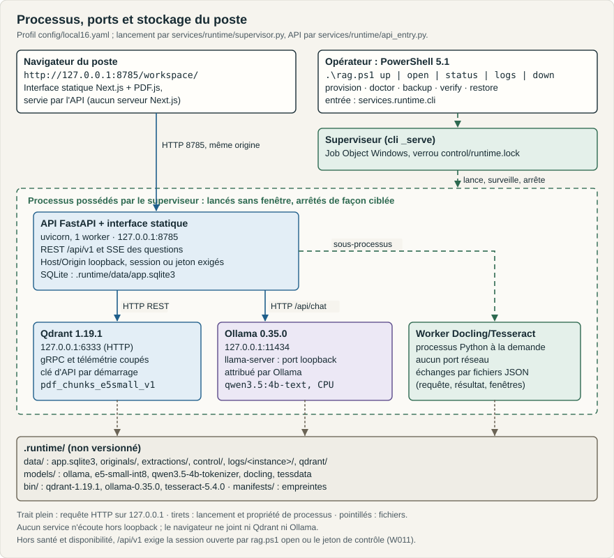
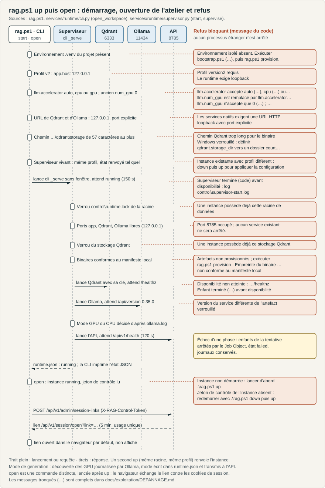
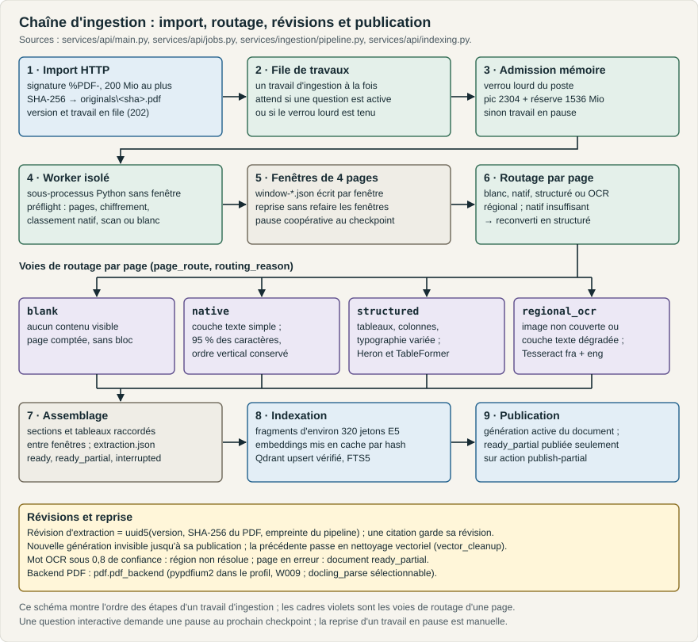
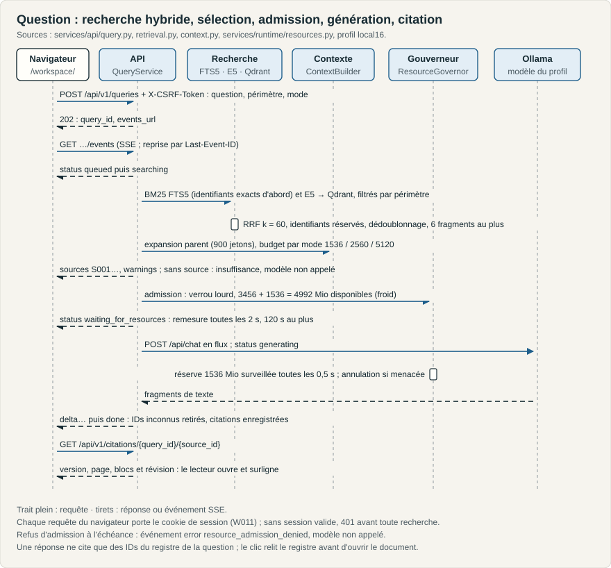

# Architecture technique du poste documentaire local

**Rôle :** architecture de l'état livré (composants, flux, interfaces, données, sécurité, déploiement, observabilité) et écarts avec l'exigence V2.1 · **Propriétaire :** architecture et intégration · **Statut :** Stabilisé · **Référence :** commit `e4c7caf` ; accélération GPU de la génération (section 5.1 et passages qui y renvoient dans les sections 1, 2, 3.1, 5, 6, 8, 9, 10 et 11) au commit `4d8ba68`, essayée le 2026-10-02 sur le poste Linux aarch64 de développement ; télémétrie d'ONNX Runtime (section 2) et état de couverture des identifiants (section 5, ligne « Contexte », renvoi `context.py:167-263` à la numérotation de `419b526`) au commit `419b526`, rejoués le 2026-10-02 (rejeux R4 et R7) ; plateforme Linux (sections 1, 2 et 9), ligne « Réponses » de la section 8, état d'exécution de la section 5.1 et ligne « Clés de profil déclaratives » de la section 11 relus au commit `36824e2` le 2026-10-02 ; comportements d'ingestion W029 (section 4), y compris la reprise de densité, sur le commit de base `5ca3685` et modifications locales du 2026-10-02, vérifiés sur les fixtures Linux aarch64 ; propriétaire et renvois documentaires R14-1 sur le commit `5ca3685` et modifications locales du 2026-10-02 ; choix de modèle R23 relu dans le code intégré et modifications locales du 2026-10-04, sans qualification native transférée ; parcours natifs R23 sur la fixture QV-01 vérifiés le 2026-10-04 en Linux aarch64, limites au journal ; reprise OCR de rangée W033 sur la base `1d73064` et sources locales du 2026-10-05, extraction P03 Linux vérifiée avec limites au journal ; admission froide par profil W036 livrée à `ab6e0cc`, renvoi de la section 5 corrigé le 2026-10-06 ; plafonds du contexte relus sur les profils vérifiés W039 du 2026-10-06, base `497d901` et correctif local R25-LEN-01 ; modèle par défaut W045 et estimations d'admission W041 et W046 (sections 2 et 5), distribution par le kit hors ligne Linux (sections 1, 9 et 10) sur la base `78ec95c` et les modifications locales R26-MOD-01 et R26-KIT-04 du 2026-10-07, vérifiés en unités ; graphie des chemins d'une installation (section 9) et relais des refus de `installer.sh` par `status` (section 10) relus le même jour sur l'installateur de la ronde 6 (`install.sh` SHA-256 `20144693…`, `linux_install.py` SHA-256 `919adc8e…`), vérifiés en unités ; Office R28 : base `64e191f` et modifications locales du 10/10/2026, contrats et tests isolés vérifiés, chaîne DEV native Linux aarch64 vérifiée, réserves de qualification maintenues ; résolution des références R28-RAG-01/W056 sur base `18dc8f8` et six modules locaux gelés, régressions proportionnées historiques 767 PASS + 1 SKIP Windows/768, puis delta langue originale vérifié 23 PASS ; typage configuré actuel Linux/Win32 statique acquis ; neuf contrôles HTTP natifs Linux aarch64 sans LLM réussis, historique et programme installé inchangés ; revue indépendante acquise et sources publiées `1af9c0f`, suite générale initiale rouge/incomplète conservée · **Mis à jour :** 2026-10-10 23:00 (UTC) · **Source de vérité :** le code de `services/`, `apps/web/`, `rag.ps1`, `rag.sh`, `bootstrap.sh`, `tools/dist/` pour la distribution, et les profils livrés `config/local16-4b.yaml` (choix par défaut) et `config/local16.yaml` ; les renvois `fichier:ligne` pointent vers la référence `e4c7caf`, ceux des passages sur l'accélération GPU désignent une fonction à `4d8ba68` · **Remplace :** aucun document (l'exigence reste [SPEC_ARCHITECTURE.md](../../RAG_Local_Agents/SPEC_ARCHITECTURE.md))

Ce document décrit ce qui est implémenté et ce qui a été exécuté, avec la preuve correspondante. Ce qui n'est que codé ou testé unitairement est signalé comme tel ; les écarts avec la [spécification V2.1](../../RAG_Local_Agents/SPEC_ARCHITECTURE.md) sont regroupés en [section 11](#11-écarts-constatés-avec-lexigence-v21).

## Sommaire

1. [Contexte et contraintes](#1-contexte-et-contraintes)
2. [Composants et processus](#2-composants-et-processus)
3. [Flux principaux](#3-flux-principaux)
4. [Ingestion des PDF](#4-ingestion-des-pdf)
5. [Recherche, contexte et génération](#5-recherche-contexte-et-génération)
6. [Interfaces](#6-interfaces)
7. [Données et identités](#7-données-et-identités)
8. [Sécurité](#8-sécurité)
9. [Déploiement](#9-déploiement)
10. [Exploitation et observabilité](#10-exploitation-et-observabilité)
11. [Écarts constatés avec l'exigence V2.1](#11-écarts-constatés-avec-lexigence-v21)

## 1. Contexte et contraintes

| Contrainte | Origine | Effet sur l'architecture |
|---|---|---|
| Un poste Windows 11 x86-64, sans WSL ni Docker | [W001](../../RAG_Local_Agents/DECISIONS.md#w001-plateforme-windows-native) | Binaires Windows officiels de Qdrant et d'Ollama, Python 3.12 isolé, supervision par Job Object |
| Distribution interne Linux installable par l'utilisateur, hors ligne, sans droit d'administration ni modification globale | [W040](../../RAG_Local_Agents/DECISIONS.md#w040-reprise-r26--réserves-linux-et-distribution-interne-linux), R26-KIT-04 | Kit par plateforme et par commit, installateur par utilisateur avec versions côte à côte, données hors programme et pointeur de version ([section 9](#9-déploiement)) |
| Linux natif aarch64 ou x86-64 comme seconde plateforme, sans élévation de privilèges, Windows inchangé | [W018](../../RAG_Local_Agents/DECISIONS.md#w018-double-plateforme--windows-11-x86-64-et-linux-aarch64-natifs) | Mêmes composants et même verrou d'artefacts, binaires Linux officiels, Tesseract compilé en espace utilisateur, supervision par groupes de processus POSIX ([section 2](#2-composants-et-processus), [section 9](#9-déploiement)) |
| 16 Gio physiques partagés avec le navigateur et d'autres applications ; le CPU reste le socle, la référence de la recette et le repli | D-01, révisée par [W024](../../RAG_Local_Agents/DECISIONS.md#w024-accélération-gpu-détectée-proposée-et-utilisée-automatiquement-quand-elle-est-disponible) et [W025](../../RAG_Local_Agents/DECISIONS.md#w025-accélération-gpu--arbitrages-de-réalisation-w024) ; [DEFINITION_OF_DONE.md](../../RAG_Local_Agents/DEFINITION_OF_DONE.md) D07 | Un seul travail lourd à la fois, admission mémoire avant chaque chargement, réserve hôte de 1 536 Mio |
| Génération des réponses sur GPU quand le poste en dispose sur une voie qualifiée par un essai réel | [W024](../../RAG_Local_Agents/DECISIONS.md#w024-accélération-gpu-détectée-proposée-et-utilisée-automatiquement-quand-elle-est-disponible), [W025](../../RAG_Local_Agents/DECISIONS.md#w025-accélération-gpu--arbitrages-de-réalisation-w024) | Seul le modèle de réponse, exécuté par Ollama, change de matériel ; extraction, OCR et embeddings restent sur CPU sur toutes les plateformes. Le mode est décidé une fois par instance et l'API gère le repli sur CPU ([section 5.1](#51-accélération-gpu-de-la-génération)) |
| Mono-utilisateur, hors ligne en exploitation | D-01, D08, [W011](../../RAG_Local_Agents/DECISIONS.md#w011-session-locale-du-poste-ouverte-par-un-lien-à-usage-unique) | Toutes les écoutes sur 127.0.0.1, même origine pour l'interface et l'API, aucun téléchargement hors provisionnement ; pas de compte, mais une session de navigateur ouverte depuis le poste par un lien à usage unique |
| Traçabilité des réponses | D05, D-11 | Texte source immuable par révision d'extraction, registre de citations par question |

## 2. Composants et processus

*Processus du poste, ports d'écoute et dossiers de `.runtime/` ; tirets : propriété de processus, trait plein : HTTP local.*

| Composant | Processus lancé | Écoute | Responsabilités | Code |
|---|---|---|---|---|
| Lanceur | `.\rag.ps1 <commande>` dans PowerShell 5.1, qui exécute `.venv\Scripts\python.exe -m services.runtime.cli <commande>` | — | Valide l'environnement, transmet profil et options, rend le code de sortie ; `open` demande un lien d'ouverture de session et l'ouvre dans le navigateur par défaut | [rag.ps1:1-41](../../rag.ps1), [cli.py:422-443](../../services/runtime/cli.py#L422-L443), [cli.py:446-509](../../services/runtime/cli.py#L446-L509) |
| Superviseur | `python -m services.runtime.cli _serve`, sans fenêtre | — | Verrous, contrôles, lancement et surveillance des enfants dans un Job Object avec arrêt à la fermeture, trace des ressources, arrêt coopératif | [supervisor.py:333-453](../../services/runtime/supervisor.py#L333-L453), [windows_process.py:57-78](../../services/runtime/windows_process.py#L57-L78) |
| Qdrant 1.19.1 | `qdrant.exe --config-path <data>\control\qdrant.yaml --disable-telemetry`, clé d'API reçue par `QDRANT__SERVICE__API_KEY` | 127.0.0.1:6333 HTTP, gRPC désactivé | Vecteurs denses, filtres de périmètre, snapshots ; toute requête hors `/`, `/healthz`, `/readyz`, `/livez` exige l'en-tête `api-key` | [supervisor.py:231-260](../../services/runtime/supervisor.py#L231-L260), [W010](../../RAG_Local_Agents/DECISIONS.md#w010-clé-dapi-qdrant-propre-à-chaque-vie-du-serveur) |
| Ollama 0.35.0 | `ollama.exe serve` ; lance lui-même `llama-server` | 127.0.0.1:11434 ; `llama-server` sur un port local choisi par Ollama | Chargement et exécution du modèle du profil : `qwen3.5:4b-text` avec le profil 4B, choisi par défaut ([W045](../../RAG_Local_Agents/DECISIONS.md#w045-qwen-35-4b-par-défaut-2b-conservé-au-lancement)), `qwen3.5:2b` avec le profil 2B ; sur CPU ou, si l'instance est en mode GPU, sur le GPU ; découverte des GPU écrite dans son journal avant de servir HTTP ([section 5.1](#51-accélération-gpu-de-la-génération)) | [supervisor.py:117-140](../../services/runtime/supervisor.py#L117-L140), [relevé des écoutes](../../RAG_Local_Agents/reports/listening-sockets-20260930T0930.json) |
| API | `python -m services.runtime.api_entry` : uvicorn, un worker, `timeout_graceful_shutdown=120` ; HTTPS avec le certificat et la clé du profil en production | 127.0.0.1:8785 | Frontière locale, session et CSRF, routes `/api/v1`, SSE, file de travaux, réconciliation vectorielle, service de l'export statique | [api_entry.py:10-35](../../services/runtime/api_entry.py#L10-L35), [main.py:36-670](../../services/api/main.py#L36-L670) |
| Worker d'ingestion | `python -m services.ingestion.worker --request … --result …`, sans fenêtre, sorties muettes | — | Préflight, conversion par fenêtres, OCR, écriture des fenêtres et de l'extraction | [jobs.py:89-170](../../services/api/jobs.py#L89-L170), [worker.py:31-77](../../services/ingestion/worker.py#L31-L77) |
| Interface | Fichiers statiques de `apps/web/out`, montés sur `/` par l'API | — | Écran de session, barre supérieure, bibliothèque, lecteur PDF.js, analyse, suivi des traitements | [main.py:667-669](../../services/api/main.py#L667-L669), [apps/web/src/](../../apps/web/src/), [session-gate.tsx](../../apps/web/src/components/session-gate.tsx) |

Sous Linux aarch64 ou x86-64 ([W018](../../RAG_Local_Agents/DECISIONS.md#w018-double-plateforme--windows-11-x86-64-et-linux-aarch64-natifs)), le lanceur est `./rag.sh`, qui retire `LD_LIBRARY_PATH`, pose `PYTHONUTF8=1` et se remplace par `.venv/bin/python -m services.runtime.cli` ; les binaires de Qdrant et d'Ollama sont ceux des archives Linux du verrou, sans suffixe `.exe`. Le superviseur lance chaque service sans shell, dans sa propre session et son propre groupe de processus, sous `setpriv --pdeathsig TERM` : `PosixJob` ([posix_process.py](../../services/runtime/posix_process.py)) tient lieu du Job Object, avec SIGTERM au groupe pour l'arrêt de Qdrant et d'Ollama et SIGKILL au groupe à la fermeture ; les verrous de la racine des données, du stockage Qdrant et du poste passent par `flock` au lieu du verrou d'octets Windows ([supervisor.py](../../services/runtime/supervisor.py), [resources.py](../../services/runtime/resources.py)). Un processus de l'instance encore vivant après la mort du superviseur est signalé par `status` (`orphan_processes`) et fait refuser `up` ([EXPLOITATION.md, section 8](../exploitation/EXPLOITATION.md#8-reprendre-après-un-incident)).

Les enfants reçoivent un environnement construit explicitement : quelques variables Windows utiles, puis `RAG_PROFILE`, `RAG_DATA_DIR`, les variables hors ligne et sans télémétrie (Hugging Face, Next.js, Ollama), les limites de threads (`OMP_NUM_THREADS=2`…) et la configuration d'Ollama (`OLLAMA_NUM_PARALLEL=1`, `OLLAMA_MAX_LOADED_MODELS=1`, `OLLAMA_MAX_QUEUE=2`, `OLLAMA_CONTEXT_LENGTH`, `OLLAMA_KEEP_ALIVE=10m`, cache de prompt de 256 Mio et deux checkpoints de contexte) ([supervisor.py:117-140](../../services/runtime/supervisor.py#L117-L140)). La clé d'API de Qdrant, tirée à chaque démarrage, n'est transmise qu'à l'enfant Qdrant (`QDRANT__SERVICE__API_KEY`) et à l'API (`RAG_QDRANT_API_KEY`) ; elle n'est écrite ni dans `qdrant.yaml` ni dans `runtime.json`, et le fichier `control/qdrant-api-key` destiné aux outils de l'instance est supprimé à l'arrêt ([supervisor.py:231-245](../../services/runtime/supervisor.py#L231-L245)). Avant chaque création d'enfant, `WindowsJob.launch` rétablit le traitement de CTRL+C, que le lanceur aurait sinon transmis ignoré à Qdrant et Ollama ([windows_process.py:57-65](../../services/runtime/windows_process.py#L57-L65)). L'accélération GPU ne change pas cet environnement : `environment()` est le même quel que soit le mode, sans variable `OLLAMA_*`, `CUDA_*` ni `LD_LIBRARY_PATH` ajoutée (instantanés Windows et Linux de [test_runtime_supervisor.py](../../tests/unit/test_runtime_supervisor.py)). Le mode décidé au démarrage n'est transmis qu'à l'API, par `RAG_LLM_ACCELERATOR` et `RAG_LLM_ACCELERATOR_REASON` (`supervise`, [supervisor.py](../../services/runtime/supervisor.py)). La télémétrie d'ONNX Runtime, moteur du modèle de recherche, ne dépend pas de cet environnement : ONNX Runtime lit `ORT_DISABLE_TELEMETRY` une seule fois, quand il se charge, et l'API pose cette variable à `1` dès l'import de [embedding.py](../../services/api/embedding.py), avant le chargement fait par `import_onnxruntime`, seul import d'ONNX Runtime du produit (garde statique dans [test_api_gateways.py](../../tests/unit/test_api_gateways.py)) ; le worker d'extraction la reçoit dans `WORKER_FIXED_ENVIRONMENT` ([jobs.py](../../services/api/jobs.py)). Elle n'agit que sous Linux, où elle empêche la création du client d'envoi, des événements et de l'identifiant d'appareil. Sous Windows, la télémétrie d'ONNX Runtime passe par ETW, qui ne lit pas cette variable : ses événements ne sont enregistrés que si une session de traces les collecte, et leur transmission à Microsoft dépend du consentement de l'utilisateur géré par le système ; le produit ne la coupe pas ([Privacy.md 1.30.0, « Disabling Telemetry »](https://github.com/microsoft/onnxruntime/blob/v1.30.0/docs/Privacy.md#disabling-telemetry), [telemetry_environment.h](https://github.com/microsoft/onnxruntime/blob/v1.30.0/onnxruntime/core/platform/telemetry_environment.h)).

## 3. Flux principaux

### 3.1 Démarrage

`rag.ps1 up` valide le profil (schéma 2, hôte `127.0.0.1`, `llm.accelerator` à `auto`, `cpu` ou `gpu`, ou forme antérieure `llm.num_gpu: 0`, URL `http://127.0.0.1:<port>` sans identifiant ni chemin ; `load_profile`, [supervisor.py](../../services/runtime/supervisor.py)), borne le chemin du stockage Qdrant, puis lance le superviseur et attend 150 s au plus son état `running`. Le superviseur prend le verrou de la racine, vérifie les ports, prend le verrou du stockage Qdrant, capture le manifeste des sources, contrôle l'empreinte des binaires, tire la clé d'API de Qdrant et lance Qdrant, Ollama et l'API en attendant la réponse de chacun ([supervisor.py:333-414](../../services/runtime/supervisor.py#L333-L414), [start 456-490](../../services/runtime/supervisor.py#L456-L490)). Entre Ollama et l'API, dès que `/api/version` répond, il lit dans `ollama.log` la découverte des GPU qu'Ollama a journalisée, décide le mode de génération, l'écrit dans `runtime.json` (clé `accelerator`) et lance l'API avec ce mode (`instance_accelerator` et `supervise`, [supervisor.py](../../services/runtime/supervisor.py) ; [section 5.1](#51-accélération-gpu-de-la-génération)). L'origine de l'API vient de `app_origin` : `http://127.0.0.1:<port>` en développement, `https://127.0.0.1:<port>` vérifiée par le certificat du profil en production ([supervisor.py:143-152](../../services/runtime/supervisor.py#L143-L152)) ; `doctor`, `open` et `backup` l'emploient aussi. Toute exception arrête les enfants de la tentative par fermeture du Job Object et écrit l'état `failed` ([supervisor.py:439-453](../../services/runtime/supervisor.py#L439-L453)).

*Contrôles de `rag.ps1 up` dans l'ordre du code, demande du lien d'ouverture par `rag.ps1 open`, et message de chaque refus.*

Exécutions conservées : premier démarrage et second `up` idempotent ([premier up](../../RAG_Local_Agents/reports/runtime-first-up.json), [second up](../../RAG_Local_Agents/reports/runtime-first-duplicate-up.json)) ; profil restauré relancé sur le code du lot R4 ([up du 30/09 à 13:57](../../RAG_Local_Agents/reports/runtime-restored-newcode-up-20260930T1357.json)).

### 3.2 Ouverture de l'atelier

`up` n'ouvre pas de navigateur. `rag.ps1 open` vérifie que l'instance est `running`, lit le jeton de contrôle dans `control/admin-token`, obtient de l'API un lien d'ouverture à usage unique valable 5 min et l'ouvre dans le navigateur par défaut sans l'afficher ([cli.py:422-443](../../services/runtime/cli.py#L422-L443)). Le navigateur échange ce lien contre un cookie de session `HttpOnly` et un cookie CSRF, puis arrive sur `/workspace/` ; l'interface ne montre l'espace de travail qu'après une réponse 200 de `GET /api/v1/session` et, sinon, affiche un écran qui explique le refus et donne la commande à copier ([session-gate.tsx:22-65](../../apps/web/src/components/session-gate.tsx#L22-L65), [session.ts:49-64](../../apps/web/src/lib/session.ts#L49-L64)). Détail des échanges, des cookies et des refus : [API.md, section 2](../interfaces/API.md#2-session-et-autorisation). Exécution réelle : `rag.ps1 open` a ouvert l'atelier dans le navigateur de l'utilisateur le 30/09 vers 18:30 UTC, événements `session_link_issued` puis `session_opened` au journal d'audit ([journal du 30/09](../../RAG_Local_Agents/journal/2026-09-30.md), entrée 18:28–18:31) ; [E2E de session 3/3](../../apps/web/reports/e2e-2026-09-30-r17-readonly-1830-evidence.json).

### 3.3 Arrêt

`rag.ps1 down` crée le marqueur `control/shutdown-<instance>`. Le superviseur passe à `stopping`, crée le marqueur de l'API ; uvicorn s'arrête, la fermeture de l'application annule les questions, demande un checkpoint au worker actif et attend sa fin ([main.py:83-97](../../services/api/main.py#L83-L97), [jobs.py:276-286](../../services/api/jobs.py#L276-L286)). Le travail actif finit à l'état `paused` avec le code `checkpointed`, reprenable depuis ses fenêtres écrites : `JobSupervisor.cancelled` ne tient plus compte de la fermeture de l'API ([jobs.py:50-54](../../services/api/jobs.py#L50-L54)). Avant cette correction, un arrêt propre faisait passer le travail actif à `cancelled` (défaut observé le 30/09 à 18:25 UTC, reproduit par `test_api_closing_checkpoints_the_active_job_instead_of_cancelling_it` dans [test_api_jobs.py](../../tests/unit/test_api_jobs.py), puis redéploiement avec arrêt en 9 s : [journal du 30/09](../../RAG_Local_Agents/journal/2026-09-30.md), entrées 18:22–18:31). L'arrêt de l'API ferme aussi toutes les sessions, dont le registre est en mémoire. Le superviseur attend l'API 180 s puis envoie une interruption console à Ollama et Qdrant, 30 s chacun ; au-delà, le Job Object termine les processus restants et le mode est consigné (`forced_job_close_after_stop_timeout`) ([supervisor.py:422-438](../../services/runtime/supervisor.py#L422-L438)). `down` rend la main quand l'état devient `stopped` ou `failed`, 250 s au plus ([supervisor.py:493-508](../../services/runtime/supervisor.py#L493-L508)). Exécutions conservées : arrêt forcé de Qdrant et d'Ollama quand le lanceur avait hérité d'un CTRL+C ignoré ([avant correction](../../RAG_Local_Agents/reports/runtime-down-before-ctrlc-fix-20260930T1636.json)), puis arrêt par interruption console, code 0 pour les trois services ([après correction](../../RAG_Local_Agents/reports/runtime-down-after-ctrlc-fix-20260930T1637.json)).

### 3.4 Import, question et sauvegarde

L'ingestion est décrite en [section 4](#4-ingestion-des-pdf), la question en [section 5](#5-recherche-contexte-et-génération), la sauvegarde dans [SAUVEGARDE-RESTAURATION.md](../exploitation/SAUVEGARDE-RESTAURATION.md).

## 4. Ingestion des PDF

*Étapes d'un travail d'ingestion, voies de routage d'une page et règles de révision.*

| Étape | Comportement livré | Code |
|---|---|---|
| Import | 1 à 50 fichiers par requête, chemins relatifs validés (ni absolu, ni `..`, ni nom réservé Windows, extension `.pdf`), flux écrit dans `uploads/*.part` avec SHA-256 et limite de taille, signature `%PDF-` exigée dans le premier kilo-octet, déplacement atomique vers `originals/<sha256>.pdf`, version et travail créés ; réponse 202 | [main.py:414-462](../../services/api/main.py#L414-L462), [db.py:25-45](../../services/api/db.py#L25-L45) |
| File | Un travail `queued` à la fois, dans l'ordre de création ; attend tant qu'une question est active, qu'une pause est demandée ou que le verrou lourd du poste est tenu ailleurs | [jobs.py:60-87](../../services/api/jobs.py#L60-L87), [resources.py:246-249](../../services/runtime/resources.py#L246-L249) |
| Admission | Verrou lourd du poste, déchargement du modèle Ollama, admission à 2 304 + 1 536 Mio ; sinon travail `paused` avec son motif | [resources.py:298-317](../../services/runtime/resources.py#L298-L317), [main.py:53-55](../../services/api/main.py#L53-L55) |
| Worker | Réutilise une extraction vérifiée en cache ; sinon lance le worker, relaie annulation et pause par le fichier `checkpoint-request` ; chien de garde : 300 s sans nouvelle fenêtre durable, arrêt ciblé du worker, travail en pause avec le code `interrupted` et repris depuis les fenêtres écrites ; le `worker-result.json` d'une exécution précédente est supprimé avant chaque lancement, si bien qu'une reprise ne relit jamais l'ancien résultat ; un worker terminé sans résultat donne `worker_failed` avec son code de sortie (`details.worker_exit_code`) ; une exception inattendue met le travail en `error` (code `ingestion_failed`) et son type, son message et sa pile sont écrits dans `api.log` (journal `rag.jobs`) ; un échec de conversion Docling (`DOCLING_CONVERSION_FAILED`) garde dans son avertissement un résumé de ses erreurs (5 au plus : composant, module, 240 premiers caractères du message) | [jobs.py:89-170](../../services/api/jobs.py#L89-L170), [jobs.py:73-76](../../services/api/jobs.py#L73-L76), [docling_adapter.py:156-161](../../services/ingestion/docling_adapter.py#L156-L161), [pipeline.py:107](../../services/ingestion/pipeline.py#L107) |
| Préflight | PDFium : taille, nombre de pages (2 000 au plus), chiffrement (`PDF_ENCRYPTED`), boîtes MediaBox, CropBox et boîte effective, classement natif, scan ou blanc | [preflight.py:63-100](../../services/ingestion/preflight.py#L63-L100) |
| Fenêtres | Fenêtres de 4 pages ; chaque fenêtre complète est écrite (`window-XXXXXX-YYYYYY.json`) et relue à la reprise ; une fenêtre en échec de conversion est reconvertie ; contrôle `ORIGINAL_CHANGED` en fin de lecture | [pipeline.py:286-345](../../services/ingestion/pipeline.py#L286-L345), [checkpoint.py](../../services/ingestion/checkpoint.py) |
| Routage | Voir le tableau suivant ; en mode automatique et hors repli après un refus de rendu, une page native qui échoue au contrôle de qualité peut être reconvertie en structuré si le budget de rendu l'autorise et qu'aucun arrêt n'est demandé (`NATIVE_ESCALATED_TO_STRUCTURED`). Après `PDF_RENDER_LIMIT`, une couche native fiable peut être conservée sans le rendu refusé ; la limite reste non résolue | `page_route`, `native_quality`, `_extract_window` dans [pipeline.py](../../services/ingestion/pipeline.py) (W029 local) |
| Assemblage | Sections portées d'une fenêtre à l'autre, sans rouvrir une section pour un en-tête courant répété en marge haute ; titre « (suite) » rattaché à la section correspondante. Continuité de tableau entre pages adjacentes seulement avec mêmes en-têtes, mêmes colonnes et même section, plus positions en bord de page ou titre de continuation immédiatement avant le tableau suivant et absence de contenu hors marge basse après le précédent ; couverture par page ; état `ready`, `ready_partial` ou `interrupted` ; indicateur `parser_complete` par fenêtre et pour le document, vrai seulement si toutes les conversions Docling ont réussi sans `partial_success` | `running_header`, `continues_section`, `ends_page`, `stitch_structure`, `extract_pdf` dans [pipeline.py](../../services/ingestion/pipeline.py) (W029 local) |
| Indexation | Découpage `section-pack-v1` ([W015](../../RAG_Local_Agents/DECISIONS.md#w015-découpage-section-pack-v1--blocs-courts-dune-même-section-regroupés-jusquà-la-cible)) : blocs consécutifs de texte et de titres d'une même section et d'une même page joints jusqu'à 320 jetons E5, une source par bloc (`chunk_sources`) ; tableaux, figures, légendes, blocs sans section et blocs plus longs restent seuls, coupés avec un chevauchement de 48 jetons au plus ; embeddings mis en cache par identité du modèle et hash du texte, envoi à Qdrant par lots de 64 avec attente puis relecture des hash | [indexing.py:21-261](../../services/api/indexing.py#L21-L261), [retrieval.py:163-172](../../services/api/retrieval.py#L163-L172) |
| Publication | Compte des fragments vérifié ; génération active remplacée dans une transaction ; ancienne génération marquée pour nettoyage vectoriel. Règle [W012](../../RAG_Local_Agents/DECISIONS.md#w012-figures-non-interprétées--limite-déclarée-publication-automatique) (`text_loss`) : une extraction est publiée d'office, à l'état `ready` et avec ses avertissements, sauf si du texte manque ou n'est pas prouvé présent : pages manquantes, zone non résolue d'un autre motif qu'une figure non interprétée, page en erreur qui avait du texte, `parser_complete` absent ou faux (toute extraction antérieure à W012). Dans ces cas, la génération reste `ready_partial` et n'est publiée que par `POST /jobs/{id}/publish-partial` | [indexing.py:97-120](../../services/api/indexing.py#L97-L120), [indexing.py:260-284](../../services/api/indexing.py#L260-L284), [main.py:631-640](../../services/api/main.py#L631-L640) |
| État du document | Un document publié suit sa génération active ; un document sans génération publiée prend l'état de son dernier travail (`paused` pour `pausing`, `cancelled` pour `cancelling`, `ready_partial` pour une extraction partielle à publier), réaligné au démarrage, à chaque pause, reprise ou annulation et à la publication différée | [db.py:158-188](../../services/api/db.py#L158-L188), [jobs.py:224-268](../../services/api/jobs.py#L224-L268) |
| Redémarrage de l'API | Travaux en cours passés à `paused` avec le code `interrupted`, états des documents réalignés ; reprise manuelle, travail par travail ou groupée (`POST /api/v1/jobs/resume-paused`) | [db.py:117-124](../../services/api/db.py#L117-L124), [jobs.py:252-257](../../services/api/jobs.py#L252-L257) |

| Voie (`page_route`) | Condition | Traitement |
|---|---|---|
| `blank` | Aucun contenu visible | Page comptée, aucun bloc |
| `regional_ocr` | Régions image non couvertes ou couche texte dégradée (`needs_ocr`) | Pipeline Docling de mise en page et de tableaux avec OCR Tesseract CLI `fra`+`eng` limité aux régions (mode `PDF_AWARE_LAYOUT_REGIONS` quand la version installée le propose) ; orientation OSD indéterminée : aucun mot reconnu arbitrairement à 0°, région `OCR_ORIENTATION_UNRESOLVED` ; mot sous 0,8 de confiance : région non résolue. Les grilles croisées ou séparateurs horizontaux fins alignés avec gouttières entre colonnes peuvent produire un dérivé pour OCR cellulaire, sans concaténer ses résultats avec l'OCR global des mêmes cellules ni modifier l'original ; les gardes refusent une bande pleine, des lignes désalignées ou l'absence de colonnes. Chaque zone OCR et chaque tableau sont ramenés dans la page avant découpe (marge de 0,01 pt, zone de moins d'un point écartée), PDFium refusant une découpe qui déborde ([regional_grid.py](../../services/ingestion/regional_grid.py), [regional_tables.py](../../services/ingestion/regional_tables.py)) |
| `structured` | 8 tracés vectoriels ou plus, deux colonnes de 3 régions au moins, texte clairsemé avec tracés, tailles de police différentes (rapport ≥ 1,3 et écart ≥ 2 pt), ou page non native | Pipeline Docling avec modèles locaux de mise en page (Heron) et de tableaux (TableFormer, mode `ACCURATE`), sans OCR ; si la couche texte du PDF est fiable et que les blocs en gardent moins de 95 % des caractères alphanumériques, la page est reprise par la voie `native`, gardée si celle-ci couvre le texte et localise ses blocs (ordre vertical non exigé), sinon la perte est déclarée (`STRUCTURED_TEXT_LOSS`, extraction partielle) ; vérifié sur CPR-07A, pages 5, 8 et 9 reprises le 01/10 ([pipeline.py:98-103](../../services/ingestion/pipeline.py#L98-L103), [pipeline.py:195-226](../../services/ingestion/pipeline.py#L195-L226)) |
| `native` | Page native simple | Pipeline natif de Docling (`NativePdfPipelineOptions`), sans OCR ; contrôle : 95 % des caractères alphanumériques retrouvés, blocs localisés, ordre vertical monotone |

Après `PDF_RENDER_LIMIT`, le routage automatique tente le même convertisseur natif sans modèles uniquement si la page est classée `native` ou `mixed`, avec couche non clairsemée, caractères alphanumériques présents et aucun avertissement de mapping. Il conserve les blocs si au moins 95 % de cette couche sont retrouvés et localisés ; l'ordre vertical peut être non monotone, sans garantie de structure de tableau ou de colonnes. Le refus de rendu, ses pixels et une région non résolue restent enregistrés ; le document reste `ready_partial`, y compris après reprise depuis le checkpoint. Ni OCR ni rendu structuré ne sont déclarés récupérés. Une route imposée n'est pas remplacée et le plafond livré de 8 millions de pixels n'est pas relevé ([pipeline.py](../../services/ingestion/pipeline.py), [test_ingestion_render_fallback.py](../../tests/integration/test_ingestion_render_fallback.py)).

Une cellule déjà admissible n'est pas remplacée par une reprise. Pour un petit glyphe à confiance insuffisante ou sans mot reconnu, `small_glyph_density_retry_v1` peut exécuter une unique reprise ×2 LANCZOS : un composant d'encre, hauteur ≤24 pixels, crop de côté ≤64 pixels et budget régional vérifié avant allocation. Le moteur, les langues, PSM et seuil restent identiques. Une confiance non finie dans une baseline non vide reste invalide, sans reprise qui la masque. Le dérivé n'est adopté qu'avec confiances admissibles et boîtes finies, positives et contenues ; son facteur est inversé avant les offsets et transformations vers les points PDF. Hashes, tailles, facteur, confiances et choix sont tracés dans les métadonnées du crop, sans texte OCR. Ces bornes sont un choix local, pas une prescription de Tesseract ([regional_grid.py](../../services/ingestion/regional_grid.py), [W029](../../RAG_Local_Agents/DECISIONS.md#w029-levée-du-gel-de-lingestion-w022)).

Après les reconnaissances cellulaires, `grid_row_native_density_retry_v1` peut reprendre une rangée d'une grille validée qui contient une cellule imprimée vide ou sous le seuil. Le contexte conserve la densité native, PSM 6, les langues et la bordure configurées ; un retry mono-glyphe déjà tenté ou une confiance non finie exclut cette rangée. Les rectangles source et final sont bornés avant allocation à 2048×128 pixels, l'encre à 48 pixels, le cumul au budget régional et les appels supplémentaires à 32. Tout le candidat doit être admissible : confiances finies, boîtes positives dans le crop, containment complet dans une cellule unique, aucune cellule imprimée perdue. Les textes des voisines admissibles doivent être confirmés littéralement ; seules les cellules initialement insuffisantes sont adoptées. Un refus ou une erreur récupérable conserve la baseline. Les offsets du crop sont inversés vers le raster dérivé puis le cadre source/page par la transformation existante ; les métadonnées d'incertitude sont calculées après sélection. Le choix et les budgets sont tracés dans `ocr_preprocessing[].row_context_ocr` et `row_context_budget`, sans texte moteur ([regional_row_context.py](../../services/ingestion/regional_row_context.py), [W033](../../RAG_Local_Agents/DECISIONS.md#w033-reprise-ocr-limitée-au-contexte-dune-rangée-de-grille)).

Cette reprise a été vérifiée sur l'extraction complète de P03 CC0 en Linux aarch64 : original, page native et cellules voisines conservés. Elle ne qualifie ni Windows ni P02, dont les signes scientifiques ne sont pas couverts par les alphabets inspectés ; publications et qualité RAG restent à vérifier. [Preuve et limites](../../RAG_Local_Agents/journal/2026-10-05.md#r23-ocr-01--contexte-de-rangée-p03-relevé-0015-utc).

Les comportements W029 de cette section ont été vérifiés sur les fixtures Linux aarch64, y compris le scan à 90° après la reprise ciblée ; résultats et périmètres encore à qualifier sont consignés dans le [plan](../../RAG_Local_Agents/PLAN.md) et le [journal du 2 octobre](../../RAG_Local_Agents/journal/2026-10-02.md). Cette preuve ne vaut pas validation du corpus du poste, de Windows ou de D02 dans son ensemble.

Les options de chaque voie sont fixées dans [docling_adapter.py:68-102](../../services/ingestion/docling_adapter.py#L68-L102). Le backend PDF de Docling est choisi par `pdf.pdf_backend` ([config.py:37](../../services/ingestion/config.py#L37) : `docling_parse` par défaut du code, `pypdfium2` accepté). Le profil `local16` retient `pypdfium2` avec une translation des coordonnées PDFium vers la CropBox d'origine zéro, appliquée par `crop_translation` et `crop_consistent_pdfium_page_class` ([lifecycle.py:108-166](../../services/ingestion/lifecycle.py#L108-L166)) ([W009](../../RAG_Local_Agents/DECISIONS.md#w009-backend-pdf-nominal-pypdfium2-avec-repère-cropbox-corrigé)). Cette correction est validée sur les fixtures synthétiques, pas sur le corpus métier, et doit être revérifiée à chaque mise à jour de Docling.

Tests de la règle de publication et de l'indicateur du parseur : [test_api_publication_policy.py](../../tests/unit/test_api_publication_policy.py), `test_api_graphic_only_partial_extraction_is_published_automatically` et `test_api_startup_realigns_documents_left_behind_their_last_job` dans [test_api_jobs.py](../../tests/unit/test_api_jobs.py), `test_parser_completeness_is_recorded_per_window_and_for_the_document` et `test_conversion_failure_keeps_the_docling_error_summary_in_its_warning` dans [test_ingestion_pipeline.py](../../tests/unit/test_ingestion_pipeline.py) ([série du 30/09 à 19:47, 437 tests PASS](../../RAG_Local_Agents/reports/backend/2026-09-30-r20-w012-full.xml)). Ce dernier test vérifie la propagation du résumé par le pipeline avec un double de session ; la lecture de `result.errors` sur un vrai échec Docling n'est pas exercée. Aucun document réel n'a encore été réextrait avec l'indicateur `parser_complete` : sur le corpus du poste, W012 prévoit que seul « Evaluation module4 » devienne publiable d'office après réextraction.

Le worker active `faulthandler` : une faute native observée rend l'extraction non publiable (`INGESTION_NATIVE_FAULT`), et un journal de faute antérieur met l'extraction en quarantaine (`EXTRACTION_QUARANTINED`) ([worker.py:41-65](../../services/ingestion/worker.py#L41-L65)).

### 4.1 Documents DOCX et XLSX

L’intégration Office du 10 octobre est implémentée et vérifiée par des tests isolés ; sa chaîne native DEV Linux aarch64 est vérifiée. L’[étude du 9 octobre](../../RAG_Local_Agents/reports/extension-office-2026-10-09.md) conserve ses mesures exploratoires datées ; le suivi courant est dans [R28 du plan](../../RAG_Local_Agents/PLAN.md#r28--étude-de-lextension-docxxlsx-avant-implémentation).

L’import commun conserve `format` et `mime_type` par version, valide le package OPC avant sa publication et copie l’original dans `originals/<sha256>.<extension>`. Le worker [office/worker.py](../../services/ingestion/office/worker.py), choisi par [jobs.py](../../services/api/jobs.py), est un processus distinct du worker PDF ; il utilise la même admission du gouverneur. La lecture ne charge ni Docling ni modèle de mise en page. `python-docx 1.2.0` et `openpyxl 3.1.5` sont des dépendances directes verrouillées ; les adaptateurs lisent l’OOXML original, avec les helpers maintenus d’openpyxl pour les formats numériques, dates et formules partagées. Ils ne chargent pas une seconde copie complète du classeur. [opc.py](../../services/ingestion/office/opc.py) contrôle ZIP, CRC, chemins, parties, relations, quotas et XML sans DTD/entités/réseau, pour les namespaces Strict et Transitional.

| Format | Unités et structures conservées | Localisation source | Limites déclarées |
|---|---|---|---|
| DOCX | Parties et notes, ordre des paragraphes/tableaux, styles et hiérarchie, listes, grilles/fusions et tableaux imbriqués, révisions selon la vue finale, liens, images et légendes sources | Partie OPC, chemin d’élément et ID déterministe ; hash du texte source et révision d’extraction | Pas de pagination Word inventée ni d’OCR des images ; objets non interprétés signalés. Seules les images raster enregistrées et vérifiées sont affichées |
| XLSX | Feuilles dans l’ordre et avec leur visibilité, cellules présentes et types exacts, dates 1900/1904, tables/en-têtes/fusions, noms, commentaires, formules et caches séparés, relations | Partie/feuille, adresse A1, plage et bindings en points de code Unicode | Aucun recalcul, macro ou lien externe exécuté ; fraîcheur du cache inconnue. Les dimensions déclarées n’imposent pas un rectangle matérialisé ; extensions inconnues signalées |

Les valeurs numériques gardent leur représentation exacte ; le jour fictif Excel 1900 reste identifié. Une formule `t="str"` avec un élément valeur vide possède un cache chaîne vide ; une valeur numérique vide ou un élément valeur absent ne devient pas un zéro. Les chaînes ST_Xstring sont décodées une seule fois, avec le XML brut distinct et des paires UTF-16 converties en points de code ; une séquence Unicode invalide est refusée. Les formules restent littérales ([xlsx.py](../../services/ingestion/office/xlsx.py), [tests XLSX](../../tests/unit/test_office_xlsx.py)).

[pipeline.py](../../services/ingestion/office/pipeline.py) écrit les unités complètes dans `office-units/`, avec SHA original, fingerprint du parseur/options et hash du payload. La reprise vérifie ces trois identités avant réutilisation ; une pause au milieu d’une unité ne la déclare pas complète. La sortie `extraction.json` porte structures, couverture et avertissements. L’API persiste les faits structurés et leur texte d’indexation dans SQLite, puis réutilise FTS5, E5 et Qdrant avec la publication atomique existante. Une extraction Office non couverte reste `ready_partial` et sa publication est explicite ; la génération précédente reste disponible jusque-là.

Les limites par défaut sont définies dans [OfficeLimits](../../services/ingestion/office/models.py) et validées par la section `office` du [schéma de profil](../../services/runtime/profile_schema.py). Elles sont des garde-fous logiciels, pas une qualification du poste CPU/16 Go.

| Paramètre `office` | Valeur par défaut | Portée |
|---|---:|---|
| `max_members` | 10 000 | Membres ZIP |
| `max_total_bytes`, `max_part_bytes` | 268 435 456 ; 67 108 864 | Octets décompressés du package ; d’une partie |
| `max_compression_ratio` | 1 000 | Rapport de compression admis |
| `max_xml_depth`, `max_elements` | 128 ; 2 000 000 | Profondeur et nombre d’éléments XML |
| `max_units`, `max_blocks` | 10 000 ; 100 000 | Unités source et blocs dérivés |
| `max_cells`, `max_shared_strings` | 100 000 ; 100 000 | Cellules présentes du classeur ; chaînes partagées |
| `max_text_chars`, `max_cell_chars`, `max_block_chars` | 20 000 000 ; 100 000 ; 8 000 | Texte extrait ; cellule ; projection XLSX dérivée. Le découpage DOCX conserve ses textes source |

Le lecteur XLSX consulte une fenêtre de 10 000 positions au plus, par requêtes SQL clairsemées. La recherche d’une plage est plus étroite : 1 000 cellules présentes, 200 000 caractères et 2 048 fragments au plus. [office_search.py](../../services/api/office_search.py) projette uniquement les bindings autorisés avant les statistiques FTS5, les identifiants, E5, RRF et le top-k ; les embeddings sont cachés avec leur identité complète, sans collection Qdrant par plage. Les en-têtes hors plage ne sont pas ajoutés au contexte. Une limite est refusée explicitement, sans remplacement par le classeur entier. La précision et les localisateurs Office se transmettent aux sources, au contexte du modèle et aux citations ; `page_index` reste nul et les pages sont vides.

Les lecteurs [DOCX](../../apps/web/src/components/office-docx-reader.tsx) et [XLSX](../../apps/web/src/components/office-xlsx-reader.tsx) affichent les structures de la révision publiée, avec la version et la révision épinglées pour les citations. Ils ne constituent pas un rendu bureautique exact. Les routes, leur pagination et les scopes sont définis dans l’[API, versions et lecture](../interfaces/API.md#44-versions-et-lecture).

## 5. Recherche, contexte et génération

*Échanges d'une question, de la recherche hybride à l'ouverture d'une citation.*

| Étape | Comportement livré | Code |
|---|---|---|
| File des questions | Au plus 1 + `llm.max_pending_generations` (2) questions `queued` ou `running`, sinon 429 `query_queue_full` ; une seule question traitée à la fois | [query.py:28-54](../../services/api/query.py#L28-L54), [query.py:178](../../services/api/query.py#L178) |
| Périmètre | Résolution en générations publiées, versions, pages et blocs autorisés, avec avertissements (`document_not_in_scope`, `comparison_incomplete`, `dense_unavailable_for_historical_revision`) | [scope.py](../../services/api/scope.py) |
| Relances | Focus explicite validé dans le périmètre ; référent implicite repris des questions précédentes seulement s’il est unique et encore autorisé. Un candidat présent dans la question actuelle empêche cet héritage ; plusieurs référents admis : `needs_clarification`. Search désactive l’héritage implicite ; l’historique de l’assistant n’est jamais une preuve | `QueryEngine.resolve_followup`, [query.py](../../services/api/query.py), route Search dans [main.py](../../services/api/main.py) |
| Lexical | FTS5 `bm25(chunks_fts, 2.0, 1.0)` filtré par périmètre ; candidats exacts placés en tête puis classés par le BM25 de la question ; 24 résultats. Une référence explicitement nommée dispose aussi d’un matching NFKC/casse sur les blocs autorisés, avant plafonnement des occurrences validées | `HybridSearch`, [retrieval.py](../../services/api/retrieval.py), projection Office dans [office_search.py](../../services/api/office_search.py) |
| Dense | Requête E5 préfixée `query: `, requête Qdrant `points/query` sur le vecteur `dense`, filtre de périmètre, `hnsw_ef` 64, 24 résultats | [retrieval.py:153-161](../../services/api/retrieval.py#L153-L161) |
| Fusion | RRF k = 60, identifiants exacts gardés devant | [retrieval.py:93-98](../../services/api/retrieval.py#L93-L98), [retrieval.py:205-230](../../services/api/retrieval.py#L205-L230) |
| Sélection | Priorité exacte conservée pour les candidats, y compris les composés alphabétiques sans obligation ; dédoublonnage par parent et texte, 6 fragments au plus (8 en comparaison ou pour plusieurs candidats). Couverture et avertissements d’identifiant absent calculés sur les obligations seulement ; extraction partielle signalée | [retrieval.py](../../services/api/retrieval.py) |
| Contexte | Expansion au parent (900 jetons au plus), budget d'instructions de 1 024 jetons, budget de preuves 1 536, 2 560 ou 4 864 selon le mode depuis W039 ; plafonds effectifs et réserve de sortie dans [IMPLEMENTATION.md §7](../../RAG_Local_Agents/IMPLEMENTATION.md#7-contexte-conversation-et-génération). Comptage par le tokenizer Qwen ; fragments écartés signalés ; état de couverture de chaque obligation de référence résolue (`identifier_coverage_states` de `done`), contrôle lexical qui ne conclut à l'absence de réponse (avertissement `identifier_present_no_answer_evidence`) que si la question originale et les passages qui portent l'identifiant ne sont pas dans deux langues reconnues différentes ; les cinq états sont décrits dans [API.md, section 5](../interfaces/API.md#5-flux-sse-dune-question) | `ContextBuilder.build`, [context.py](../../services/api/context.py) |
| Admission | Verrou lourd du poste ; si le modèle n'est pas chargé et la mémoire insuffisante, libération des sessions E5 et des tokenizers ; admission au pic froid du profil actif + réserve hôte (valeurs et portée dans le [dépannage](../exploitation/DEPANNAGE.md#6-questions-et-génération) ; règle W036, estimations [W041](../../RAG_Local_Agents/DECISIONS.md#w041-admission-froide-du-2b-relevée-après-un-pilote-exclusif-aux-limites-w039) pour le 2B et [W046](../../RAG_Local_Agents/DECISIONS.md#w046-admission-du-4b-relevée-après-un-pilote-exclusif-aux-limites-w039) pour le 4B) ou au pic additionnel déclaré par le modèle chargé ; attente de 120 s au plus avec remesure toutes les 2 s. Mêmes estimations en mode GPU ([W025](../../RAG_Local_Agents/DECISIONS.md#w025-accélération-gpu--arbitrages-de-réalisation-w024), P9) ; en mode CPU, un modèle résident en partie sur le GPU compte comme froid, alors qu'en mode GPU le runner déjà chargé est réutilisé quel que soit son placement (`loaded_state`, [ollama.py](../../services/api/ollama.py)) | [main.py:56-73](../../services/api/main.py#L56-L73), [resources.py:141-155](../../services/runtime/resources.py#L141-L155), [resources.py:319-377](../../services/runtime/resources.py#L319-L377) |
| Génération | Vérification de l'identité du modèle (digest et manifeste), `POST /api/chat` en flux, `think: false`, `num_thread` = min(4, cœurs physiques − 1) ; `num_gpu: 0` en mode CPU, corps identique octet pour octet à celui d'avant l'accélération GPU, option absente en mode GPU ; repli sur CPU décrit en [section 5.1](#51-accélération-gpu-de-la-génération) ; réserve surveillée toutes les 0,5 s | [ollama.py:111-135](../../services/api/ollama.py#L111-L135) ; à `4d8ba68`, `chat_options` et `stream` dans [ollama.py](../../services/api/ollama.py) |
| Validation | Dépassement du contexte réel refusé (`runtime_context_exceeded`), écart de comptage signalé ; identifiants inconnus remplacés, images Markdown et balises HTML retirées ; `done.citations` ne contient que les sources citées, toutes les sources retenues restant enregistrées et consultables par leur `citation_url` | [query.py:240-261](../../services/api/query.py#L240-L261), [context.py:255-269](../../services/api/context.py#L255-L269) |

Une seule `ReferenceResolution` est construite depuis la question originale après autorisation du scope et du focus, puis transmise à Search, Query, l'évaluation et la comparaison. Elle sépare les candidats, les obligations et les occurrences de blocs sources ; l'ajout d'une note de focus à la question effective ne déclenche pas une seconde détection. La priorité de recherche utilise tous les candidats ; les métriques et avertissements de couverture utilisent les obligations. Le contrat et les limites sont définis dans l'[API](../interfaces/API.md#5-flux-sse-dune-question) et [W056](../../RAG_Local_Agents/DECISIONS.md#w056-références-candidates-et-obligations-de-couverture-distinctes).

Le complément de recherche du focus parcourt les chunks filtrés par fenêtres de 128, préteste leur texte normalisé avant reconstruction d'une source, vérifie chaque occurrence dans un bloc autorisé et s'arrête lorsque chaque référence focalisée atteint `retrieval.lexical_top_k` occurrences admises (24 dans les profils livrés). Le tampon est borné ; une référence absente peut encore entraîner un parcours complet du périmètre. Aucun registre métier, migration ou réindexation n'est ajouté. L'empreinte du selector d'évaluation et de comparaison inclut désormais `office_search.py` : une modification de la projection Office invalide les anciens résultats associés à cette empreinte.

État d'exécution : une génération réelle a été admise sur l'instance restaurée (réponse partielle « 3,1 bar [S001] ») puis annulée par la surveillance de la réserve ([preuve](../../RAG_Local_Agents/reports/backend/2026-09-30-restored-question-20260930T0927.json)) ; la dernière tentative est refusée à l'échéance de l'attente ([preuve](../../RAG_Local_Agents/reports/backend/2026-09-30-restored-question-w008-20260930T1405.json)). Aucune réponse complète n'est encore qualifiée.

Le modèle est choisi au démarrage, pas dans le corps d'une question. `model_profile_path` dans [cli.py](../../services/runtime/cli.py) sélectionne un fichier réel ; le superviseur transmet son chemin dans `RAG_PROFILE` et enregistre son SHA-256. Une instance active avec un autre profil exige un arrêt puis un redémarrage. Un profil utilisateur explicite n'est ni réécrit ni surchargé par `--model` ; les deux options sont exclusives.

| Choix livré | Fichier runtime | Modèle servi / source | Identité et tokenizer |
|---|---|---|---|
| Défaut ([W045](../../RAG_Local_Agents/DECISIONS.md#w045-qwen-35-4b-par-défaut-2b-conservé-au-lancement)), ou `--model qwen3.5:4b` | [local16-4b.yaml](../../config/local16-4b.yaml) | `qwen3.5:4b-text` / `qwen3.5:4b` | Q4_K_M ; dérivation texte seule W006 ; tokenizer `Qwen/Qwen3.5-4B` |
| `--model qwen3.5:2b` | [local16.yaml](../../config/local16.yaml) | `qwen3.5:2b` / même modèle | Q8_0 ; manifeste source et servi commun ; tokenizer `Qwen/Qwen3.5-2B` |

Les identités attendues viennent de [models.lock.json](../../config/models.lock.json) et [artifacts.lock.json](../../config/artifacts.lock.json). Le provisionnement retient le tokenizer du profil, sans retirer les enregistrements des autres tokenizers déjà présents. `doctor` compare uniquement les modèles source et servi de ce profil au verrou : l'absence d'un modèle non choisi ne rend pas ce contrôle rouge. Quantification, digest, manifeste brut et ordre des couches restent contrôlés. Les valeurs de pic mémoire des deux profils sont des estimations tirées de pilotes CPU exclusifs sur le Jetson du chantier (W041 pour le 2B, W046 pour le 4B) : elles ne valent ni pour un hôte de 16 Go ni pour D07. Les preuves natives 4B citées dans ce document ne qualifient pas le 2B ; les résultats R23 sont tenus au [plan](../../RAG_Local_Agents/PLAN.md#r23--choix-du-modèle-de-génération-et-défaut-qwen-35-2b).

Le changement de modèle ne modifie pas les paramètres PDF, E5 ou le découpage des profils livrés. Il n'invalide pas automatiquement les générations déjà publiées : le périmètre sélectionne les générations actives sans comparer leur fingerprint au tokenizer courant, et la collection dense dépend de l'identité E5. Le contexte et l'expansion des parents recomptent les preuves avec le tokenizer courant. En revanche, le fingerprint d'une nouvelle génération d'index inclut les fichiers du tokenizer LLM ; une réindexation explicitement demandée peut donc produire une identité nouvelle, sans réextraction systématique si l'extraction vérifiée est réutilisable (`Indexer.generation_fingerprint`, [indexing.py](../../services/api/indexing.py), `ScopeResolver.resolve`, [scope.py](../../services/api/scope.py), `QdrantStore.collection`, [retrieval.py](../../services/api/retrieval.py), `cached_extraction`, [jobs.py](../../services/api/jobs.py)). L'essai R23 du 4 octobre a réutilisé l'index publié de la seule fixture QV-01 lors des bascules 4B→2B→4B, avec réponses et citations versionnées, sans réimport ni réindexation ; [preuve bornée](../../RAG_Local_Agents/journal/2026-10-04.md#r23--choix-au-lancement-et-parcours-natifs-validés-relevé-2202-utc). Cette observation ne qualifie ni un autre corpus ni un changement d'extraction ou d'embedding.

### 5.1 Accélération GPU de la génération

Depuis [W024](../../RAG_Local_Agents/DECISIONS.md#w024-accélération-gpu-détectée-proposée-et-utilisée-automatiquement-quand-elle-est-disponible) et [W025](../../RAG_Local_Agents/DECISIONS.md#w025-accélération-gpu--arbitrages-de-réalisation-w024), le modèle de réponse peut être exécuté sur un GPU ; Docling, Tesseract et l'embedding E5 restent sur CPU sur toutes les plateformes. Le CPU reste le socle, la référence de la recette D07 et le repli. Les règles communes au superviseur, à `provision`, à `doctor`, à la calibration et à l'API sont dans [accelerator.py](../../services/runtime/accelerator.py).

| Section `llm` du profil | Accélération demandée | Effet |
|---|---|---|
| `accelerator: auto`, valeur des profils livrés [`config/local16-4b.yaml`](../../config/local16-4b.yaml) et [`config/local16.yaml`](../../config/local16.yaml) ; même effet sans aucune des deux clés (`requested_source: default`) | `auto` | GPU si Ollama découvre un GPU CUDA dont les bibliothèques sont vérifiées, sur une voie qualifiée, et, pour un GPU intégré à mémoire partagée, sur un poste de plus de 16 Gio de mémoire totale ; CPU sinon |
| `accelerator: cpu` | `cpu` | Calcul CPU imposé ; profil de la recette D07 ([QUALIFICATION.md, section 8](../../RAG_Local_Agents/QUALIFICATION.md#8-performance-et-ressources)) ; avec ce profil, un `provision` complet ne télécharge pas le complément GPU (`provision --only ollama-gpu` le télécharge quel que soit le profil) |
| `accelerator: gpu` | `gpu` | Essai du GPU sur une voie ou un poste non qualifiés, avec les mêmes contrôles et le même repli |
| `num_gpu: 0` sans `accelerator` (forme antérieure) | `cpu` (`requested_source: legacy_num_gpu`) | CPU ; `doctor` propose de passer à `auto`, ou à `gpu` sur une voie ou un poste non qualifiés |

Toute autre forme est refusée au démarrage, par `load_profile` comme par l'API, avec le message de la clé en cause ([DEPANNAGE.md, section 2](../exploitation/DEPANNAGE.md#2-démarrage)).

Le mode se décide en trois temps :

1. **Provisionnement.** Sur un Jetson, `provision` lit la version de Jetson Linux dans `/etc/nv_tegra_release` avec la règle d'Ollama (R35 donne `jetpack5`, R36 `jetpack6`, toute autre version aucun complément), puis télécharge le complément officiel du groupe `ollama-gpu` de [artifacts.lock.json](../../config/artifacts.lock.json), vérifie son SHA-256 et l'extrait par-dessus l'archive de base d'Ollama, dans le même dossier ; un profil en calcul CPU l'écarte, sauf avec `provision --only ollama-gpu`. Ollama confirme ensuite sa découverte des GPU, consignée dans `.runtime/manifests/ollama-discovery.json`. Procédure et messages : [EXPLOITATION.md, section 2](../exploitation/EXPLOITATION.md#2-préparer-le-poste).
2. **Démarrage.** Quand Ollama répond sur `/api/version`, le superviseur relit le journal `ollama.log` de l'instance : seul compte le dernier bloc qui suit la ligne `msg="discovering available GPUs..."`, avec une ligne `msg="inference compute"` par GPU retenu, ou `id=cpu` sans GPU ; les GPU qu'Ollama écarte (GPU intégré hors CUDA, cible ROCm non prise en charge) sont relevés à part (`parse_discovery`). Ollama écrit cette découverte avant de servir HTTP (`server/routes.go` v0.35.0) ; ce format de journal n'est pas un contrat d'Ollama et se revérifie à chaque montée de version. Les bibliothèques GPU sont comparées au manifeste local de leur extraction : taille de chaque fichier de `lib/ollama/<variante>` et cible de chaque lien, sans rehachage (`verified_libraries`). La décision est écrite dans `runtime.json`, clé `accelerator` (`requested`, `requested_source`, `mode`, `reason`, `device`, `variant`, `qualified`, `discovery`, `libraries`, `host`, `utc`), avant le lancement de l'API, à laquelle seule elle est transmise.
3. **API.** `Settings.llm_accelerator` ne retient le GPU que si le profil demande `auto` ou `gpu` et que le superviseur a transmis `gpu` ; sans décision transmise (API lancée hors superviseur, tests), la génération reste sur CPU. Le mode vaut pour toute la vie de l'instance, Ollama réutilisant un runner déjà chargé pour une requête sans `num_gpu` (`needsReload`, `server/sched.go` v0.35.0) : seul un repli le change, jusqu'au redémarrage.

Règles de décision, appliquées dans l'ordre (`resolve_mode`) :

| Condition | Mode | Raison (`reason`) |
|---|---|---|
| Profil en `cpu` | CPU | `imposed_by_profile` |
| Profil en forme antérieure `num_gpu: 0` | CPU | `legacy_profile_cpu` |
| Découverte absente ou illisible dans le journal | CPU | `discovery_unreadable` |
| Ollama ne découvre aucun GPU (`id=cpu`) | CPU | `no_gpu_discovered` |
| Aucun GPU CUDA parmi ceux découverts | CPU | `gpu_library_not_retained` |
| GPU CUDA accompagné d'un GPU d'une autre bibliothèque : Ollama choisirait lui-même | CPU | `gpu_mixed_libraries` |
| Bibliothèques du GPU absentes du manifeste local, ou fichiers et liens différents | CPU | `gpu_libraries_unverified` |
| Voie non qualifiée, profil en `auto` | CPU | `gpu_path_not_qualified` |
| GPU intégré à mémoire partagée (type `iGPU` de la découverte, cas des Jetson) sur une voie qualifiée, poste de 16 Gio de mémoire totale ou moins (`MemTotal` de `/proc/meminfo`), ou mémoire illisible, profil en `auto` | CPU | `gpu_unified_memory_not_qualified` |
| Voie non qualifiée, ou GPU intégré non qualifié pour la mémoire du poste, profil en `gpu` | GPU | `gpu_trial` |
| Sinon | GPU | `gpu_discovered` |

Une voie est le couple plateforme et dossier de bibliothèques d'Ollama ; seules les voies de `QUALIFIED_GPU_PATHS` emploient le GPU d'office :

| Poste | Bibliothèques d'Ollama | Voie |
|---|---|---|
| Jetson, Linux aarch64, Jetson Linux R35 (JetPack 5) | Complément officiel, dossier `cuda_jetpack5` | Qualifiée : GPU en `auto` sur un poste de plus de 16 Gio de mémoire totale. Essai réel sur le seul Jetson AGX Orin du poste de développement, 62 800 Mio de mémoire totale (ci-dessous) ; la règle (`resolve_mode`) ne tient pas compte du modèle de Jetson. Un Jetson de 16 Gio ou moins, ou dont la mémoire totale est illisible, reste sur CPU en `auto` (`gpu_unified_memory_not_qualified`, limites de l'essai ci-dessous) ; `doctor` y propose l'essai en `gpu` |
| Jetson, Linux aarch64, Jetson Linux R36 (JetPack 6) | Complément officiel, dossier `cuda_jetpack6`, verrouillé d'après la release mais jamais téléchargé ni essayé | Non qualifiée : CPU en `auto`, essai possible en `gpu` |
| Jetson d'une autre version | Aucun complément publié pour Ollama 0.35.0 | Non qualifiée ; `doctor` signale l'absence de bibliothèques si Ollama ne découvre aucun GPU |
| Linux x86-64 ou aarch64 hors Jetson, Windows x86-64, avec GPU NVIDIA | Bibliothèques CUDA de l'archive de base d'Ollama | Non qualifiées, jamais essayées : CPU en `auto`, `doctor` propose l'essai en `gpu` |
| GPU AMD ou Intel (Vulkan), ROCm | — | Jamais employés : seul CUDA est retenu |
| Poste sans GPU utilisable, dont le poste Windows de qualification, où Ollama écarte le GPU intégré Intel | — | Inchangé : CPU et corps de requête identique ; vérifié par tests sur plateforme simulée avec le journal Ollama réel de ce poste, rejeu réel sous Windows à faire (lot J11.10 du [plan](../../RAG_Local_Agents/PLAN.md)) |

**Repli sur CPU.** Ollama 0.35.0 ne se replie pas seul quand le chargement sur GPU échoue (HTTP 500 avant le flux). En mode GPU, l'API (`fall_back_to_cpu`, [ollama.py](../../services/api/ollama.py)) passe alors l'instance en CPU jusqu'au redémarrage, obtient une nouvelle admission à froid dans le bail en cours (`readmit_generation`, appelée par `before_cpu_fallback` de [main.py](../../services/api/main.py)) et relance une seule fois ; règles, statuts sans repli et métriques : [API.md, section 5](../interfaces/API.md#5-flux-sse-dune-question). Lecture du mode, de l'occupation du modèle et du repli : [section 10](#10-exploitation-et-observabilité).

**Mémoire.** L'admission ne change pas en mode GPU : aucune estimation propre au GPU tant que les mesures ne l'exigent pas (W025, P9). Sur un Jetson, le CPU et le GPU intégré partagent la même mémoire : la réserve reste surveillée sur `MemAvailable`, et `SwapFree` est relevé au même instant, sous Linux, dans `resources.jsonl` et dans les rapports de calibration (`host_sample`, [resources.py](../../services/runtime/resources.py)).

**État d'exécution.** Essai réel du 2 octobre 2026 (UTC) sur le poste Linux aarch64 de développement, Jetson AGX Orin sous Jetson Linux R35.4.1 en mode d'alimentation `MODE_30W`, avec le code du commit `4d8ba68` ; preuves hors Git sous `.runtime/qa/j11-gpu-2026-10-02/` ; essai consigné au plan (lot J11.8) et au [journal du 2 octobre](../../RAG_Local_Agents/journal/2026-10-02.md), entrée de 00:59–01:15.

| Essai | Résultat |
|---|---|
| `./rag.sh provision --only ollama-gpu`, archive déjà en cache | SHA-256 vérifié ; 4 fichiers et 3 liens extraits dans `lib/ollama/cuda_jetpack5` (825 Mio) ; commande complète en 35 s, découverte comprise ; découverte d'Ollama : Orin, CUDA, capacité 8.7, pilote CUDA 11.4, GPU intégré |
| `./rag.sh up` en `auto` | 31 s, découverte comprise ; `runtime.json` : mode `gpu`, raison `gpu_discovered`, variante `cuda_jetpack5`, voie qualifiée |
| `./rag.sh doctor` | Vert ; rubrique `calcul` à `gpu_ready` avant la première question, puis `gpu_in_use` ; `size_vram` égal à `size` dans `/api/ps` (3 107 811 491 octets) |
| `./rag.sh selftest`, profil livré en `auto` | 8 étapes PASS ; instance de contrôle démarrée en 33,1 s, génération sur GPU ; réponse citée en 65,2 s, chargement à froid du modèle depuis la carte microSD compris, modèle chargé à 100 % sur le GPU |
| `./rag.sh selftest`, copie du profil en `llm.accelerator: cpu` | 8 étapes PASS ; génération sur CPU ; réponse en 36,3 s, modèle à 100 % sur le CPU |

Calibration (`python -m services.runtime.calibration`, `--accelerator auto` et `cpu`) : invite synthétique de 2 959 tokens, sortie de 64 tokens, `num_ctx` 8192, 4 threads, statut `PASS_PILOT_ONLY` ; la mesure GPU porte la mention « Early GPU pilot on this host; never a D07 measurement ».

| Essai | GPU : premier token / total | CPU : premier token / total |
|---|---|---|
| Chargement à froid (`cold`) | 68,2 s / 74,8 s | 155,0 s / 173,6 s |
| Même préfixe, modèle chargé (`warm_same_prefix`) | 0,24 s / 6,7 s | 0,61 s / 19,1 s |
| Contenu neuf, modèle chargé (`warm_new_content`) | 10,5 s / 17,1 s | 145,5 s / 164,1 s |

Baisse maximale de `MemAvailable` pendant la calibration : 1 021 Mio sur GPU, 4 009 Mio sur CPU ; `SwapFree` inchangé dans les deux cas. Limites de l'essai :

- mémoire unifiée : après la première réponse sur GPU, `MemAvailable` n'a baissé que de 1,6 Go pour un modèle de 3,1 Go entièrement chargé sur le GPU. Une partie des allocations du GPU échappe probablement à `MemAvailable` (hypothèse H-GPU-2, pool nvmap) ; la mesure exacte exige les droits root sous R35.4.1. Un Jetson de 16 Go en mode GPU n'est donc pas qualifié, et la réserve de l'admission repose sur `MemAvailable` ;
- le repli sur CPU n'a pas été reproduit en réel, faute de pouvoir provoquer un échec de chargement sans altérer des bibliothèques vérifiées ; il est couvert par les tests unitaires (500 avant le flux, absence de repli sur 503, 499 et 4xx, nouvelle admission à froid) ;
- non essayés : Jetson Linux R36, Linux x86-64 avec GPU NVIDIA, Windows avec GPU NVIDIA, Windows PowerShell 5.1.

## 6. Interfaces

| Interface | Participants | Forme | Référence |
|---|---|---|---|
| HTTP `/api/v1` et SSE | Navigateur (session), outils locaux et CLI (jeton de contrôle) | JSON, `text/event-stream` | [API.md](../interfaces/API.md) |
| Navigateur ↔ API (session) | Interface statique, `SessionRegistry` | Cookie de session `HttpOnly` et cookie CSRF lisible, en-tête `X-CSRF-Token` sur les mutations, `GET /api/v1/session` au chargement de l'atelier | [api.ts:17-42](../../apps/web/src/lib/api.ts#L17-L42), [session-gate.tsx:22-65](../../apps/web/src/components/session-gate.tsx#L22-L65), [security.py:85-204](../../services/api/security.py#L85-L204) |
| Outils locaux ↔ API | `open`, `doctor`, `backup`, `tools/corpus/import_folder.py`, `tools/qualification/http_guards.py`, `tools/qualification/corpus_eval.py` ; outils de qualification par `api_client` | En-tête `X-RAG-Control-Token` lu dans `control/admin-token` (`control_headers`) ou dans la variable `RAG_CONTROL_TOKEN` ; origine HTTP ou HTTPS donnée par `app_origin` | [supervisor.py:143-158](../../services/runtime/supervisor.py#L143-L158), [api_client.py:32-35](../../tools/qualification/api_client.py#L32-L35) |
| Contrat partagé | API, interface, ingestion | JSON versionné (`schema_version` 3) : périmètre, page, bloc, fragment, source, événements, erreur, frontières Office | [contracts.json](../../packages/contracts/contracts.json) |
| API ↔ worker | `JobSupervisor`, `services.ingestion.worker` | Fichiers `worker-request.json`, `worker-result.json` (`{"ok": true, "result": …}` ou `{"ok": false, "error": …}`), `checkpoint-request`, `window-*.json`, `extraction.json` | [jobs.py:89-170](../../services/api/jobs.py#L89-L170), [worker.py](../../services/ingestion/worker.py) |
| Superviseur ↔ API | Superviseur, `api_entry` | Variables `RAG_SHUTDOWN_MARKER`, `RAG_CONTROL_TOKEN` et `RAG_QDRANT_API_KEY` ; `RAG_LLM_ACCELERATOR` et `RAG_LLM_ACCELERATOR_REASON`, mode et raison décidés au démarrage ([section 5.1](#51-accélération-gpu-de-la-génération)) ; en-tête `X-RAG-Control-Token` | [supervisor.py:405-410](../../services/runtime/supervisor.py#L405-L410), [main.py:125-128](../../services/api/main.py#L125-L128), [main.py:234-236](../../services/api/main.py#L234-L236) |
| CLI ↔ superviseur | `start`, `stop`, `status`, `backup`, `doctor` | `control/runtime.json` (état, identités PID + date de création + exécutable, mode de génération dans `accelerator`), marqueur `shutdown-<instance>` | [supervisor.py:46-61](../../services/runtime/supervisor.py#L46-L61) |
| API ↔ gouverneur | `QueryService`, `JobSupervisor`, `OllamaGateway` (repli) | `snapshot()`, `generation()`, `ingestion()`, `begin_interactive()`, `allow_ingestion()`, `should_checkpoint()` ; `readmit_generation()`, nouvelle admission dans le bail de génération avant une relance sur CPU (à `4d8ba68`) | [resources.py:179-377](../../services/runtime/resources.py#L179-L377) |
| API ↔ Qdrant | `QdrantStore` | HTTP REST avec en-tête `api-key` (variable de l'instance, sinon `control/qdrant-api-key`) : collections, index de payload, `points`, `points/query`, snapshots | [retrieval.py:101-175](../../services/api/retrieval.py#L101-L175), [settings.py:50-57](../../services/api/settings.py#L50-L57) |
| API ↔ Ollama | `OllamaGateway` | `/api/tags`, `/api/ps`, `/api/chat` (flux), `/api/generate` avec `keep_alive: 0` pour décharger ; en mode GPU, `/api/ps` relu aussi après chaque réponse, en tâche de fond bornée à 5 s, pour l'occupation du modèle publiée par `GET /jobs` | [ollama.py](../../services/api/ollama.py) |
| Runtime ↔ journal d'Ollama | Superviseur (`ollama.log` de l'instance), `provision` (journal du service de `pull-model` ou de la sonde), calibration (journal de son service) | Lignes `msg="inference compute"` et `msg="dropping …"` du dernier bloc qui suit `msg="discovering available GPUs..."`, lues dans le dernier Mio du journal ; format non contractuel d'Ollama 0.35.0, revérifié à chaque montée de version | `parse_discovery` et `read_discovery`, [accelerator.py](../../services/runtime/accelerator.py) |

## 7. Données et identités

La base SQLite (`<data_dir>/app.sqlite3`, WAL, clés étrangères) est la source de vérité ; Qdrant n'en porte qu'une projection vectorielle. Tables historiques des migrations `001` à `003` : `schema_version`, `folders`, `documents`, `document_versions`, `extraction_revisions`, `index_generations`, `pages`, `sections`, `blocks`, `tables_data`, `chunks`, `chunk_sources`, `identifiers`, `chunks_fts`, `jobs`, `conversations`, `query_runs`, `messages`, `citations`, `events`, `embedding_cache`, `vector_cleanup`. Au démarrage, une base de schéma plus récent que le code est refusée (`database_schema_too_new`) et la présence de FTS5 est contrôlée ([db.py:103-116](../../services/api/db.py#L103-L116)).

| Identité | Construction | Rôle |
|---|---|---|
| Version | Document + SHA-256 de l'original (unique par document) | Un réimport identique ne crée pas de nouvelle version |
| Révision d'extraction | `uuid5(version, SHA-256, empreinte du pipeline)` | Une citation garde la révision qui l'a produite |
| Génération d'index | Empreinte de l'extraction, identités E5 et du tokenizer Qwen, réglages de découpage ([indexing.py:137-141](../../services/api/indexing.py#L137-L141)) | Une nouvelle génération reste invisible jusqu'à sa publication |
| Fragment | `uuid5(génération, bloc:début:fin)` | Identifiant de point Qdrant, stable pour une génération |
| Citation | `(query_id, source_id)` avec `S001`, `S002`… | Registre propre à chaque question |

Coordonnées : points PDF de l'espace utilisateur non tourné, boîtes MediaBox, CropBox et rotation conservées, `page_index` à partir de 0 et `page_number` = `page_index` + 1 (`coordinate_system` de [contracts.json](../../packages/contracts/contracts.json)). Les décalages de sélection sont des points de code Unicode sur le texte source haché.

La collection Qdrant `pdf_chunks_e5small_v1` est créée à la première indexation depuis `config/qdrant.collection.json` (sa copie documentaire `RAG_Local_Agents/config/qdrant.collection.json` doit rester identique octet pour octet, contrôle `runtime_profile_copy` de `verify_pack`), puis ses paramètres effectifs sont relus et refusés s'ils diffèrent. Depuis [W017](../../RAG_Local_Agents/DECISIONS.md#w017-placement-mémoire-qdrant-exprimé-par-memory-forme-dépréciée-on_disk-retirée), le vecteur `dense` et le payload utilisent `memory: cold`, le graphe HNSW `memory: cached` ; dimension, distance, réplication et optimisation restent définies par le [fichier de collection](../../config/qdrant.collection.json). `placement_matches` accepte aussi l'ancienne forme `on_disk` pour la lecture d'une collection existante ([retrieval.py](../../services/api/retrieval.py)). Les index de payload portent sur `generation_id`, `version_id`, `document_id`, `page_indices` et `block_ids`.

Les sessions de navigateur ne sont écrites ni dans SQLite ni sur disque : leur registre vit dans la mémoire du processus API et ne garde que des empreintes SHA-256 ([security.py:85-204](../../services/api/security.py#L85-L204)). Le journal des événements de sécurité, `<data_dir>/logs/security-audit.jsonl`, est commun aux lancements successifs : `AuditLog` le fait tourner à 5 Mio, avec deux archives `.1` et `.2` et sans couper les lignes. Les refus de renommage reportent la rotation sans perdre les événements ; écriture asynchrone et compteurs sont décrits dans l’[API, section 2.5](../interfaces/API.md#25-refus-et-journal-daudit) ([security.py](../../services/api/security.py)).

La [migration `004`](../../services/api/migrations/004_office_documents.sql) porte le schéma SQLite à **4**, distinct de la version **3** du contrat HTTP partagé. Elle ajoute `document_versions.format` et `mime_type` (PDF par défaut pour les anciennes versions), autorise `page_index=NULL` pour les blocs/sources Office et ajoute `office_documents`, `office_units`, `office_unit_blocks`, `office_cells` et `office_cell_bindings`. Les structures sont liées à la génération et les cellules/bindings aux unités et blocs ; aucune page PDF factice n’est créée. Les IDs, textes, hashes, fragments FTS et citations PDF sont recopiés sans changement par la migration. Une sauvegarde SQLite cohérente, vérifiée par `integrity_check` et `foreign_key_check`, est créée dans `<data_dir>/schema-backups/` avant la montée de version ; elle ne remplace pas une sauvegarde complète des originaux et de Qdrant ([db.py](../../services/api/db.py), [tests migration](../../tests/unit/test_office_storage.py)). Le démarrage ne rejoue que les migrations manquantes.

## 8. Sécurité

| Mesure | Comportement | Code | Vérification |
|---|---|---|---|
| Profil en boucle locale | URL HTTP `127.0.0.1` à port explicite, sans identifiant, chemin, requête ni fragment | [supervisor.py:25-39](../../services/runtime/supervisor.py#L25-L39), [settings.py:14-32](../../services/api/settings.py#L14-L32) | [tests de profil](../../RAG_Local_Agents/reports/runtime-profile-loopback.xml) |
| Frontière HTTP | `Host` limité à `127.0.0.1:<port>`, `localhost:<port>`, `[::1]:<port>` (400) ; `Origin` étrangère ou d'un autre schéma que celui de l'environnement (403) ; `Sec-Fetch-Site: cross-site` (403) ; corps limité à la taille maximale de PDF + 1 Mio (413) ; en-têtes `nosniff`, `no-referrer`, CSP `default-src 'self'` et `frame-ancestors 'none'`, `X-Frame-Options: DENY`, `Permissions-Policy`, `Cross-Origin-Opener-Policy: same-origin`, `Cache-Control: no-store` par défaut et `Vary: Cookie` sur `/api/`, HSTS en production | [main.py:162-212](../../services/api/main.py#L162-L212) | [essai sur serveur réel](../../RAG_Local_Agents/reports/host-origin-live-20260930T0930.json), [gardes réelles 19/19](../../RAG_Local_Agents/reports/http-guards-live-20260930T1829.json) |
| Jeton de contrôle | Jeton aléatoire de 32 octets régénéré à chaque lancement, comparé en temps constant, fichier supprimé à la fin du superviseur ; seul accepté sur `/api/v1/admin/*`, accepté ailleurs à la place d'une session, sans jeton CSRF | [supervisor.py:363-364](../../services/runtime/supervisor.py#L363-L364), [main.py:125-128](../../services/api/main.py#L125-L128), [main.py:234-236](../../services/api/main.py#L234-L236) | [Tests HTTP en processus](../../tests/integration/test_api_http.py), [gardes réelles 19/19](../../RAG_Local_Agents/reports/http-guards-live-20260930T1829.json) |
| Session du navigateur ([W011](../../RAG_Local_Agents/DECISIONS.md#w011-session-locale-du-poste-ouverte-par-un-lien-à-usage-unique)) | Refus par défaut des routes `/api/v1` hors sondes et session ; lien d'ouverture de 256 bits à usage unique, valable 5 min, émis contre le jeton de contrôle ; cookie `HttpOnly`, `SameSite=Strict`, `Path=/` ; registre en mémoire (empreintes SHA-256) ; inactivité 120 min comptée sur les seules requêtes marquées comme activité (les relectures périodiques de l'atelier portent `X-RAG-Background: 1` et ne la prolongent pas), durée absolue 12 h, motif d'expiration gardé après purge ; rotation à l'ouverture ; révocation par déconnexion, par `POST /api/v1/admin/sessions/revoke` ou par redémarrage de l'API | [security.py:85-204](../../services/api/security.py#L85-L204), [main.py:140-160](../../services/api/main.py#L140-L160), [main.py:238-278](../../services/api/main.py#L238-L278) | [test_api_session.py](../../tests/integration/test_api_session.py) (9 tests dans la [série du 30/09 à 18:13](../../RAG_Local_Agents/reports/backend/2026-09-30-r17-r18-full.xml) ; 2 tests ajoutés ensuite, dans la [série du 30/09 à 19:47, 437 tests PASS](../../RAG_Local_Agents/reports/backend/2026-09-30-r20-w012-full.xml)), [gardes réelles 19/19](../../RAG_Local_Agents/reports/http-guards-live-20260930T1829.json), [E2E de session 3/3](../../apps/web/reports/e2e-2026-09-30-r17-readonly-1830-evidence.json) |
| Falsification de requête (CSRF) | Jeton synchroniseur propre à la session, remis dans un cookie lisible et exigé dans `X-CSRF-Token` sur `POST`, `PUT`, `PATCH` et `DELETE` ; la déconnexion ne révoque qu'avec ce jeton ; s'ajoute aux contrôles `Origin` et `Sec-Fetch-Site` | [main.py:156-159](../../services/api/main.py#L156-L159), [main.py:270-278](../../services/api/main.py#L270-L278), [api.ts:17-21](../../apps/web/src/lib/api.ts#L17-L21) | [test_api_session.py](../../tests/integration/test_api_session.py) |
| Mode production | `security.environment: production` : HTTPS sur 127.0.0.1 avec le certificat et la clé du profil, cookies `Secure` et préfixés `__Host-`, HSTS, `/api/docs` et `/openapi.json` désactivés ; l'API refuse de démarrer si les fichiers TLS manquent | [security.py:42-58](../../services/api/security.py#L42-L58), [api_entry.py:15-22](../../services/runtime/api_entry.py#L15-L22), [main.py:100-102](../../services/api/main.py#L100-L102) | [test_api_tls.py](../../tests/integration/test_api_tls.py) : serveur uvicorn HTTPS réel, certificat de test ; non exercé par `rag.ps1 up` |
| Journal d'audit | Ouvertures, liens refusés, refus d'accès, CSRF refusés, révocations ; empreintes tronquées, ni jeton ni texte de document | [security.py:197-204](../../services/api/security.py#L197-L204) | `test_security_headers_and_audit_without_secrets` ; événements réels du 30/09 vers 18:30 ([journal](../../RAG_Local_Agents/journal/2026-09-30.md)) |
| Qdrant | Clé d'API aléatoire propre à chaque démarrage ; sans elle, 401 sur toute route hors `/`, `/healthz`, `/readyz`, `/livez`, y compris avec un `Host` ou une `Origin` étrangers ; la restauration utilise sa propre clé | [supervisor.py:231-245](../../services/runtime/supervisor.py#L231-L245), [backup.py:303-337](../../services/runtime/backup.py#L303-L337) | [Gardes HTTP réelles, 15/15](../../RAG_Local_Agents/reports/http-guards-live-20260930T1636.json), [test sur le binaire](../../tests/integration/test_runtime_qdrant_auth.py) |
| Chemins importés | Chemin relatif sûr exigé (décodage répété, `..`, lecteurs, caractères et noms réservés Windows refusés) | [db.py:25-45](../../services/api/db.py#L25-L45) | [Tests de stockage](../../tests/unit/test_api_storage.py) |
| Sauvegardes | Chemins de snapshot relatifs sans `..`, antislash ni deux-points ; liens symboliques et points de reparse refusés à la copie | [backup.py:84-126](../../services/runtime/backup.py#L84-L126) | [tests de sauvegarde](../../RAG_Local_Agents/reports/runtime-backup-tests-final.xml) |
| Réponses | Aucun HTML ni image distante rendus ; identifiants de citation filtrés par le registre | [context.py:255-269](../../services/api/context.py#L255-L269) | Scénario E2E `hostile-markup` exécuté sur le poste Windows le 2026-10-01 (D08.6) et sur le poste Linux aarch64 le 2026-10-02 (tableau « Qualification Linux » de la [DoD](../../RAG_Local_Agents/DEFINITION_OF_DONE.md#qualification-linux-w018), ligne D08) |
| Environnement des enfants | Seules des variables Windows listées sont héritées : aucun identifiant de service ni réglage d'autres projets | [supervisor.py:117-124](../../services/runtime/supervisor.py#L117-L124) | Relecture de code |
| Matériel de la génération | Aucune route publique (`/health`, `/readiness`, ouverture et fermeture de session) ne publie le matériel ; le mode, la raison et le repli ne sont lus que par `/diagnostics` et `/jobs`, qui exigent la session ou le jeton de contrôle ; le nom du GPU reste dans `runtime.json`, lu par les commandes locales `status`, `doctor` et `selftest` | `generation_device` et `diagnostics`, [main.py](../../services/api/main.py) (à `4d8ba68`) | [test_api_llm_accelerator.py](../../tests/unit/test_api_llm_accelerator.py) : routes publiques sans information matérielle, 401 sans session |

Limites :

- une instance démarrée avant l'introduction de la clé (W010) reste sans clé jusqu'à son redémarrage ; la clé Qdrant circule en clair sur la boucle locale (pas de TLS) ;
- en développement, le cookie de session, le jeton CSRF et le jeton de contrôle circulent eux aussi en clair sur la boucle locale ;
- tant qu'un document sans extraction publiée est ouvert, le lecteur relit ses métadonnées toutes les 3 s sans l'en-tête `X-RAG-Background` : la session reste alors prolongée comme avant ([pdf-viewer.tsx:131](../../apps/web/src/components/pdf-viewer.tsx#L131), lecture du code) ;
- le mode production n'est vérifié que par un test d'intégration avec un certificat de test ; `tools/qualification/api_client.py` et `http_guards.py` n'acceptent que HTTP et ne joignent donc pas une instance de production (lecture du code) ;
- sous Windows, le blocage des sorties réseau de D08.1 n'a pas été exécuté : une règle de pare-feu exigerait des droits administrateur, exclus depuis le 30/09 ([journal du 30/09](../../RAG_Local_Agents/journal/2026-09-30.md), vers 18:17). Sous Linux aarch64, le scénario a été exécuté dans un espace de noms réseau utilisateur (`unshare -rn`, avec interface piège) sur le poste du chantier ; sa preuve et ses limites figurent à la ligne D08 du [tableau de qualification Linux](../../RAG_Local_Agents/DEFINITION_OF_DONE.md#qualification-linux-w018). Cet essai ne qualifie pas Windows ni Linux x86-64 ;
- la page `/api/docs`, servie en développement seulement, dépend d'un CDN bloqué par la CSP (non examinée au rendu).

## 9. Déploiement

Un seul poste, sans installation système : `bootstrap.ps1` prépare uv et CPython dans `.runtime/`, `rag.ps1 provision` récupère les artefacts verrouillés par [`artifacts.lock.json`](../../config/artifacts.lock.json) (URL figée sur une version ou un commit, licence, SHA-256 de l'éditeur ou SHA-1 de blob Git) et réutilise tout fichier déjà vérifié ([artifacts.py:76-98](../../services/runtime/artifacts.py#L76-L98)), construit l'interface avec `NODE_OPTIONS=--max-old-space-size=2048` et prépare le modèle ([cli.py:386-419](../../services/runtime/cli.py#L386-L419)). Les empreintes réellement extraites sont écrites dans `.runtime/manifests/artifacts.json` et revérifiées à chaque lancement pour Qdrant et Ollama ([supervisor.py:184-203](../../services/runtime/supervisor.py#L184-L203)). Le choix de modèle et de tokenizer suit le profil décrit en [section 5](#5-recherche-contexte-et-génération). Le 2B utilise directement le tag officiel verrouillé ; le modèle 4B `qwen3.5:4b-text` est dérivé localement du modèle source en retirant les seuls tenseurs de vision, chaque tenseur texte étant vérifié par SHA-256 ([W006](../../RAG_Local_Agents/DECISIONS.md#w006-modèle-qwen-texte-seul-dérivé-localement-sans-encodeur-vision), [text_model.py](../../services/runtime/text_model.py)). Sur un Jetson Linux R35 ou R36, le groupe `ollama-gpu` du verrou ajoute le complément GPU officiel d'Ollama, extrait dans le dossier de l'archive de base sauf profil en calcul CPU ; dans un provisionnement complet, il est facultatif : absent du cache hors ligne ou en échec de téléchargement, il est signalé et le reste du provisionnement continue (complément de W025 du 02/10/2026, `provision_artifacts`, [artifacts.py](../../services/runtime/artifacts.py)). La découverte des GPU confirmée par Ollama est écrite dans `.runtime/manifests/ollama-discovery.json`, que le kit Windows exclut parce qu'elle décrit le poste de fabrication ([build_kit.py](../../tools/dist/build_kit.py)). Sous Linux aarch64 ou x86-64 ([W018](../../RAG_Local_Agents/DECISIONS.md#w018-double-plateforme--windows-11-x86-64-et-linux-aarch64-natifs)), `bootstrap.sh` et `rag.sh provision` jouent les mêmes rôles avec les archives Linux du verrou (uv et CPython de l'architecture, Qdrant `musl`, Ollama `linux-arm64` ou `linux-amd64`) ; Tesseract 5.4.0 et Leptonica 1.87.0 y sont compilés depuis les sources verrouillées du groupe `tesseract-source` au lieu d'être copiés d'une installation existante (`build_tesseract`, [provisioning.py](../../services/runtime/provisioning.py)). Exécuté sur un clone neuf sous Linux aarch64 le 2026-10-02 (critère D01.1 du tableau « Qualification Linux » de la [DoD](../../RAG_Local_Agents/DEFINITION_OF_DONE.md#qualification-linux-w018)) ; jamais sous Linux x86-64. Procédures : [EXPLOITATION.md](../exploitation/EXPLOITATION.md).

Distribution interne sous Linux ([W040](../../RAG_Local_Agents/DECISIONS.md#w040-reprise-r26--réserves-linux-et-distribution-interne-linux)) : [linux_kit.py](../../tools/dist/linux_kit.py) compose un kit hors ligne à partir des fichiers suivis du commit courant (liste blanche) et des artefacts provisionnés d'un poste de la même plateforme ; il refuse un ELF d'une autre architecture, un lien absolu ou sortant et tout fichier qui contient un chemin du poste de fabrication, et décrit le kit dans `kit-manifest.json` (exigences du poste cible relevées dans les ELF livrés, modèles et ports de leurs profils, que l'installateur contrôle avant toute écriture, variante GPU, état de qualification), `SHA256SUMS`, `SYMLINKS` et `EXECUTABLES`. Le guide `LISEZMOI.md` du kit est rendu par [kit_guide.py](../../tools/dist/kit_guide.py) depuis le manifeste, les constantes de l'installateur et les sections canoniques de `docs/`. [install.sh](../../tools/dist/install.sh) contrôle le compte, la plateforme, la glibc et l'empreinte de l'interpréteur avant de lancer [linux_install.py](../../tools/dist/linux_install.py) avec le CPython du kit. Chaque version s'installe dans son propre dossier `<destination>/<kit_id>`, à côté des précédentes, et les données restent dans une racine distincte avec les profils de l'utilisateur. Le pointeur `<destination>/installation.json` désigne la version courante et la précédente ; il est la seule source de vérité, dont dérivent le lanceur `atelier`, l'icône, l'entrée de menu XDG et la commande `$HOME/.local/bin/atelier`. Il garde la destination telle qu'elle a été tapée, même atteinte par un lien ; l'installateur y ramène toute destination reçue, dont le chemin physique que transmet `install.sh` lancé depuis un programme installé, et compare dossiers de version, marques de propriété et registre par leur chemin réel. La bascule prépare ces fichiers, puis se valide par le renommage du pointeur ; un registre XDG (`installations.json`) ne sert qu'à retrouver les destinations. Dans un programme installé, [platforms.py](../../services/runtime/platforms.py) reconnaît l'installation (`installation()` : manifeste du kit et pointeur qui désigne ce programme) ; `doctor`, le runtime, l'API (champ `launcher` de `GET /api/v1/health`) et les écrans de session de l'atelier citent alors les commandes du lanceur au lieu de `./rag.sh`. Procédures et statut d'essai : [DEPLOIEMENT.md, section 8](../deploiement/DEPLOIEMENT.md#8-kit-hors-ligne-linux). L'installateur du commit `78ec95c` a été exercé en recette réelle sur Linux aarch64 ([journal du 6 octobre](../../RAG_Local_Agents/journal/2026-10-06.md#r26-kit-02--recette-réelle-phase-1--kit-a-6-octobre-2320-utc--7-octobre-0145-utc)) ; les modifications R26-KIT-04 ne sont vérifiées qu'en unités.

## 10. Exploitation et observabilité

| Point d'observation | Ce qu'il montre | Emplacement | Ce qu'il ne montre pas |
|---|---|---|---|
| `rag.ps1 status` | État enregistré, identités revalidées, `stale` si le superviseur a disparu, concordance du profil ; ligne `generation` : mode de génération consigné au démarrage (« Génération sur GPU, … » ou « Génération sur CPU, … »), « Dernière instance : … » hors marche | `control/runtime.json` | La disponibilité des index et du modèle ; un repli sur CPU survenu depuis le démarrage, que la ligne renvoie à `doctor` |
| `rag.ps1 doctor` | Verdict par rubrique (vert, orange, rouge) avec message et action ; versions, verrou des modèles, fichiers OCR et embedding, ports (`owned`, `foreign`, `occupied_unknown_owner`, processus nommé), marge d'admission, santé et disponibilité HTTP, modèles chargés, cohérence de l'index (points Qdrant et fragments SQLite par génération active, `index_consistency`) ; rubrique `calcul` (`checks.accelerator`) : mode de génération, découverte retenue, bibliothèques comparées au manifeste, occupation du modèle lue dans `/api/ps`, repli lu dans `/diagnostics`, et propositions d'accélération (`proposals`), qui ne changent jamais le niveau | sortie JSON, `-Report` | Une réponse complète ; le contenu des points (seuls les comptes sont comparés) ; la vitesse ou la qualité d'une réponse sur GPU |
| `rag.ps1 selftest` | Parcours réel import → extraction native → recherche → provenance dans une instance temporaire au verrou lourd partagé, puis réponse citée si admise ; mode de génération de l'instance à l'étape « démarrage », occupation du modèle et repli éventuel à l'étape « réponse » | sortie JSON (`level`, `steps`, `generation_mode`, `answer_execution`), `-Report` | La voie OCR ; la réponse quand la mémoire ne l'admet pas |
| `GET /api/v1/health` | Processus API vivant | HTTP | Stores, modèles |
| `GET /api/v1/readiness` | SQLite, fichiers E5 et tokenizer, collection Qdrant présente, ou absente sur une bibliothèque sans génération publiée (base neuve, la collection naît à la première indexation ; champ `qdrant_collection`), modèle listé par Ollama, gouverneur ; 503 avec `blockers` | HTTP | Qualité ou latence |
| `GET /api/v1/diagnostics` (session ou jeton) | Versions, ressources du gouverneur, environnement de sécurité et nombre de sessions actives, identités dense et tokenizer, caches, empreintes du profil et du sélecteur, réconciliation ; `llm_accelerator` : accélération demandée, mode, raison, repli | HTTP | Contenu documentaire (jamais exposé) ; nom du GPU |
| `GET /api/v1/jobs` (session ou jeton) | État, étape, progression, tentatives, couverture, avertissements (dont le résumé d'erreurs Docling), `runtime_mode` (priorité choisie : imports suspendus ou autorisés) ; `generation` : mode, repli et dernière occupation du modèle, lus par l'indicateur du bandeau de contexte de l'atelier | HTTP | Progression intra-fenêtre |
| Journal d'audit de sécurité | Liens émis ou refusés, sessions ouvertes, refus d'accès et motif, CSRF refusés, révocations | `<data_dir>/logs/security-audit.jsonl` | Contenu des requêtes admises |
| Événements SSE `done` | Métriques par question : `queue_wait_ms`, `retrieval_ms`, `context_ms`, `generation_admission_wait_ms`, `ttft_ms`, `elapsed_ms`, compteurs de jetons ; `llm_execution` (mode demandé à Ollama, repli dans la question) quand le modèle a été appelé | SQLite `events` | Mesures agrégées (p95) ; l'occupation réelle du modèle |
| Journaux d'instance | `qdrant.log`, `ollama.log` (dont la découverte des GPU), `api.log` (sans journal d'accès ; repli sur CPU journalisé par `rag.llm`), `resources.jsonl` (un relevé par seconde, 5 Mio × 3 fichiers, `swap_free_mib` sous Linux), `source-manifest.json` | `<data_dir>/logs/<instance>/` | Les allocations du GPU absentes de `MemAvailable` sur un Jetson ([section 5.1](#51-accélération-gpu-de-la-génération)) |
| Découverte confirmée par `provision` | Résultat de la découverte d'Ollama et bibliothèques vérifiées au même moment ; journal du service de `pull-model` (`ollama-pull.log`) ou de la sonde (`ollama-probe.log`) | `.runtime/manifests/ollama-discovery.json`, `.runtime/provision-service/` | Le mode de l'instance en marche, décidé à son démarrage |
| Démarrage du superviseur | Sortie du superviseur avant son état `running` | `<data_dir>/control/supervisor-start.log` | — |
| Traces du worker | `worker-lifecycle.jsonl`, `worker-native-fault.log`, `native-fault.json` | `<data_dir>/extractions/<version>/<travail>/` | — |
| `installer.sh status` (installation par le kit Linux) | Version courante et précédente, modèles, état de l'instance, intégration au bureau, sauvegardes avec celle qui est nécessaire au retour arrière, problèmes relevés (lanceur, icône, entrée de menu ou commande absents ou remplacés, versions non désignées, refus que l'`installer.sh` d'une version désignée opposerait à toute commande, ses contrôles rejoués par `installer.sh --controle-seul` sans lancer Python) ; code 1 si un problème est relevé | Sortie texte, `--json` ; rapports JSON des opérations de l'installateur dans la racine des données | La santé de la chaîne RAG, que donne `atelier diagnostic` (`doctor`) |

## 11. Écarts constatés avec l'exigence V2.1

| Exigence (source) | État livré | Preuve | Conséquence |
|---|---|---|---|
| Exploitation locale « sans GPU » (objectif O4, [SPEC §1](../../RAG_Local_Agents/SPEC_ARCHITECTURE.md#1-objectifs-et-contraintes)) | Génération sur GPU sur les voies qualifiées, CPU partout ailleurs et en repli ([W024](../../RAG_Local_Agents/DECISIONS.md#w024-accélération-gpu-détectée-proposée-et-utilisée-automatiquement-quand-elle-est-disponible), [W025](../../RAG_Local_Agents/DECISIONS.md#w025-accélération-gpu--arbitrages-de-réalisation-w024)) | [Section 5.1](#51-accélération-gpu-de-la-génération) | La recette D07 reste mesurée en calcul CPU imposé (`llm.accelerator: cpu`) ; une mesure sur GPU ne coche aucun critère D07 |
| Interface sur le port 8765 ([SPEC §3](../../RAG_Local_Agents/SPEC_ARCHITECTURE.md#3-architecture-dexécution)) | Port 8785 : un programme Python existant du poste occupe 8765 | [config/local16.yaml](../../config/local16.yaml), [plan](../../RAG_Local_Agents/PLAN.md#points-vérifiés-et-décisions-restantes) | Aucune ; la spécification garde l'ancienne valeur |
| Commandes `uv run python scripts/provision.py`, `start.py`, `verify.py --suite smoke`… ([IMPLEMENTATION §9](../../RAG_Local_Agents/IMPLEMENTATION.md#9-déploiement-et-commandes-à-livrer)) | Entrée unique `rag.ps1 <commande>` ; `verify -Path` contrôle un snapshot, pas une suite de tests ; `restore` exige `-Path` et `-Target` | [rag.ps1](../../rag.ps1) | Les suites de tests se lancent par pytest et Playwright |
| Types TypeScript générés depuis OpenAPI ([IMPLEMENTATION §2](../../RAG_Local_Agents/IMPLEMENTATION.md#2-contrats-http)) | Types écrits à la main, alignés sur `contracts.json` | [types.ts](../../apps/web/src/lib/types.ts) | Dérive possible entre API et interface, couverte par les tests unitaires et E2E |
| États de travail `pause_requested`, `checkpointed`, `completed` ([IMPLEMENTATION §10](../../RAG_Local_Agents/IMPLEMENTATION.md#10-extraction-et-ordonnancement--contrats-de-processus)) | États `queued`, `extracting`, `indexing`, `pausing`, `paused`, `cancelling`, `cancelled`, `ready`, `ready_partial`, `error` | [jobs.py:224-274](../../services/api/jobs.py#L224-L274) | Même sémantique coopérative, noms différents |
| `status` distingue disponible, dégradé et mémoire insuffisante ([EXPLOITATION_WINDOWS.md](../../RAG_Local_Agents/EXPLOITATION_WINDOWS.md#commandes-et-prérequis)) | `status` rend l'état du superviseur (`stopped`, `starting`, `running`, `stopping`, `failed`, `stale`) ; disponibilité et mémoire relèvent de `doctor` et de `/readiness` | [supervisor.py:511-521](../../services/runtime/supervisor.py#L511-L521) | Utiliser `doctor` pour un diagnostic |
| Contenu graphique rangé dans `unresolved` ([SPEC §6](../../RAG_Local_Agents/SPEC_ARCHITECTURE.md#6-pipeline-documentaire)), qui demande aussi des métriques « non résolue » et « graphique » distinctes | Une figure non interprétée reste une zone non résolue déclarée, mais ne bloque plus la publication ([W012](../../RAG_Local_Agents/DECISIONS.md#w012-figures-non-interprétées--limite-déclarée-publication-automatique)) | [indexing.py:97-120](../../services/api/indexing.py#L97-L120) | Document interrogeable sans décision ; la limite reste affichée (« Schémas ou images non interprétés ») |
| Clés de profil déclaratives | Depuis [W021](../../RAG_Local_Agents/DECISIONS.md#w021-invariants-du-profil-contrôlés-au-chargement-communs-aux-deux-plateformes) (1er octobre 2026), chaque clé est lue, vérifiée au chargement (profil refusé au démarrage si sa valeur diffère de la seule valeur mise en œuvre, avec la liste des clés en cause) ou déclarée informative, sans lecteur dans le code (`qdrant.vector_storage_initial`, `qdrant.hnsw_storage_initial`, `resources.application_target_max_mib`, `sqlite.path`…) ; clés vérifiées : `FIXED_PROFILE_VALUES` et contrôles du runtime (colonne suivante) ; clés lues et clés informatives : [CONFIGURATION.md](../../RAG_Local_Agents/CONFIGURATION.md), sections 6 et 7 | `FIXED_PROFILE_VALUES` dans [settings.py](../../services/api/settings.py) ; contrôles du runtime dans [supervisor.py](../../services/runtime/supervisor.py), [api_entry.py](../../services/runtime/api_entry.py) et [resources.py](../../services/runtime/resources.py) ; tests sous Linux, et en plateforme Windows simulée avec le profil livré (`test_runtime_windows_profile_invariants.py`) | Une clé vérifiée modifiée fait refuser le profil ; une clé informative modifiée reste sans effet ; suite Windows à rejouer sur le poste Windows |
| Aucune ressource distante | `GET /api/docs` (Swagger de FastAPI, développement seulement) référence un CDN, bloqué par la CSP | [main.py:100-102](../../services/api/main.py#L100-L102) | Scripts de la page bloqués par la CSP, rendu non examiné ; `/openapi.json` reste local |
| Contrats HTTP sans authentification ([IMPLEMENTATION §2](../../RAG_Local_Agents/IMPLEMENTATION.md#2-contrats-http)) | Session de navigateur ou jeton de contrôle exigés sur `/api/v1` hors sondes ([W011](../../RAG_Local_Agents/DECISIONS.md#w011-session-locale-du-poste-ouverte-par-un-lien-à-usage-unique)) | [API.md, section 2](../interfaces/API.md#2-session-et-autorisation) | Tout client autre que l'interface présente le jeton de contrôle de l'instance |
