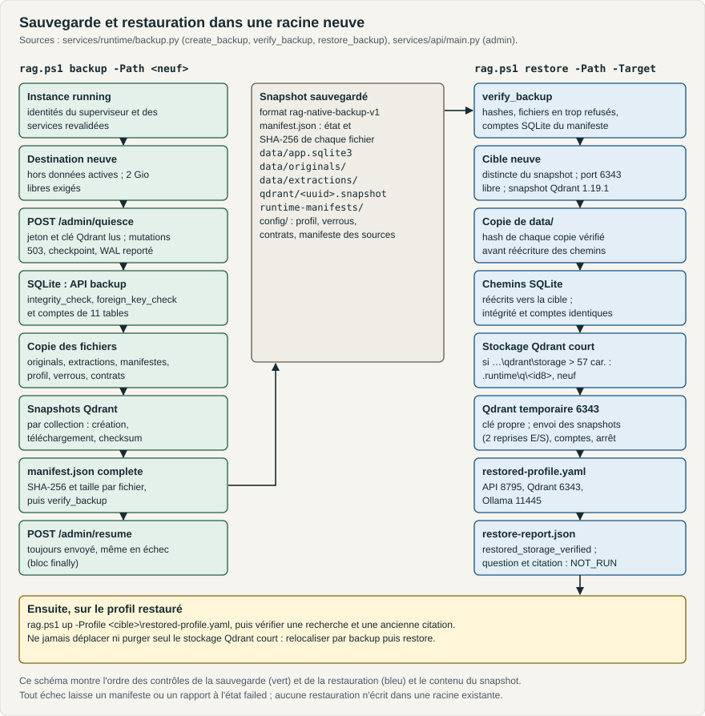

# Sauvegarde et restauration

**Rôle :** procédure de sauvegarde cohérente, de vérification et de restauration dans une racine neuve, avec ses contrôles et son retour arrière · **Propriétaire :** exploitation et intégrité des données · **Statut :** Stabilisé · **Référence :** commit `bf71f14` ; usage sous Linux (paragraphe « Sous Linux ») relu au commit `36824e2` contre `rag.sh`, `restore_backup` et `upload_snapshot`, exécuté sous Linux aarch64 le 2026-10-02 ; propriétaire et renvois documentaires R14-1 sur le commit `5ca3685` et modifications locales du 2026-10-02 ; sauvegardes d'une installation par le kit Linux (section 2) et retour arrière par l'installateur (section 6) sur la base `78ec95c` et les modifications locales R26-KIT-04 du 2026-10-07, vérifiés en unités, sans mise à jour ni retour arrière réels ; correctifs R27 du 09/10/2026 sur la base `75df760`, vérifiés en tests isolés et revue indépendante, recette native de livraison en attente · **Mis à jour :** 2026-10-09 16:48 (UTC) · **Source de vérité :** [services/runtime/backup.py](../../services/runtime/backup.py), [rag.sh](../../rag.sh), [tools/dist/linux_install.py](../../tools/dist/linux_install.py) pour l'installation par le kit Linux, routes d'administration de [services/api/main.py](../../services/api/main.py#L280-L306) ; décisions [W004](../../RAG_Local_Agents/DECISIONS.md#w004-stockage-qdrant-natif-et-chemins-de-restauration) et [W010](../../RAG_Local_Agents/DECISIONS.md#w010-clé-dapi-qdrant-propre-à-chaque-vie-du-serveur) · **Remplace :** aucun document



*Contrôles de la sauvegarde (vert), de la restauration (bleu) et contenu du snapshot.*

**Sous Linux**, les commandes sont celles de ce document, avec `./rag.sh` et les options de la correspondance d'[EXPLOITATION.md, section 1](EXPLOITATION.md#1-conventions) : `./rag.sh backup --path <dossier-neuf>`, `./rag.sh verify --path <sauvegarde>`, `./rag.sh restore --path <sauvegarde> --target <racine-neuve>`, puis `./rag.sh up --profile <racine-neuve>/restored-profile.yaml`. La borne de 57 caractères du stockage Qdrant et l'allocation d'un stockage court à la restauration (section 4, étape 2) ne valent que sous Windows (`restore_backup`, [backup.py](../../services/runtime/backup.py)). La reprise d'une erreur d'E/S transitoire (section 4, étape 5) vise les codes Win32 5, 32 et 145 relevés sous Windows, mais `upload_snapshot` ne teste pas la plateforme : sous Linux, un refus 500 de Qdrant portant « (os error 5) » (EIO) ou « (os error 32) » (EPIPE) serait aussi repris, 145 n'y désignant aucune erreur ; cas non observé. Exécution sous Linux aarch64 le 2 octobre 2026 : sauvegarde d'une instance isolée, vérification, refus d'une copie altérée, restauration dans une racine neuve, puis question et ancienne citation après restauration (critères D09.1 à D09.3 du tableau « Qualification Linux » de la [DoD](../../RAG_Local_Agents/DEFINITION_OF_DONE.md#qualification-linux-w018) ; preuves hors Git sous `.runtime/qa/j8-linux/`).

## Sommaire

1. [Ce que couvre une sauvegarde](#1-ce-que-couvre-une-sauvegarde)
2. [Sauvegarder](#2-sauvegarder)
3. [Vérifier un snapshot](#3-vérifier-un-snapshot)
4. [Restaurer](#4-restaurer)
5. [Démarrer et contrôler le profil restauré](#5-démarrer-et-contrôler-le-profil-restauré)
6. [Retour arrière et relocalisation](#6-retour-arrière-et-relocalisation)
7. [Preuves et limites](#7-preuves-et-limites)

## 1. Ce que couvre une sauvegarde

| Élément du snapshot | Contenu | Obtenu par |
|---|---|---|
| `manifest.json` | Format `rag-native-backup-v1`, état (`incomplete`, `complete` ou `failed`), racine source, empreinte du profil, version Qdrant 1.19.1, collections avec compte des points, liste des fichiers avec taille et SHA-256, résumé SQLite | Écrit au début puis réécrit à la fin |
| `data/app.sqlite3` | Base complète, journal repassé en mode `DELETE` | API de sauvegarde de `sqlite3` après checkpoint du WAL |
| `data/originals/`, `data/extractions/` | Originaux et extractions de la racine active | Copie fichier par fichier ; lien symbolique ou point de reparse refusé |
| `qdrant/<uuid>.snapshot` | Un snapshot par collection | Création puis téléchargement depuis Qdrant, checksum du serveur comparé |
| `runtime-manifests/` | Copie de `.runtime/manifests` (artefacts, modèles) | Copie |
| `config/` | `profile.yaml`, `artifacts.lock.json`, `uv.lock`, `pnpm-lock.yaml`, `pyproject.toml`, `contracts.json`, `source-manifest.json` | Copie et capture des sources |

Le snapshot ne contient ni binaires ni modèles : une restauration s'exécute depuis un dépôt déjà provisionné avec les mêmes verrous. Les tables comptées pour l'intégrité sont `documents`, `document_versions`, `extraction_revisions`, `index_generations`, `pages`, `blocks`, `chunks`, `jobs`, `query_runs`, `citations`, `embedding_cache` ([backup.py:40-41](../../services/runtime/backup.py#L40-L41), [backup.py:70-81](../../services/runtime/backup.py#L70-L81)).

## 2. Sauvegarder

Prérequis : instance démarrée par `rag.ps1 up` avec des identités valides ; destination qui n'existe pas encore et qui n'est pas sous la racine de données ; 2 Gio libres sur le volume de destination. Si ses parents n'existent pas encore, la réserve est mesurée sur son premier ancêtre existant après résolution des liens, y compris sur une SD.

```powershell
.\rag.ps1 status
.\rag.ps1 backup -Path D:\sauvegardes\rag-20260930T1500 -Report D:\sauvegardes\rag-20260930T1500-rapport.json
```

Sans `-Path`, la destination est `backups\<AAAAMMJJTHHMMSSZ>-<id8>` à la racine du dépôt (dossier ignoré par Git), ou sous `runtime.backups_dir` si le profil le fixe.

Déroulement ([backup.py:129-227](../../services/runtime/backup.py#L129-L227)) :

1. Lecture du jeton de contrôle et de la clé d'API Qdrant de l'instance (`control\admin-token`, `control\qdrant-api-key`), création de la destination et d'un manifeste à l'état `incomplete`. Les appels à l'API passent par l'origine de l'instance : HTTP en développement, HTTPS vérifié par le certificat du profil en production ([backup.py:137-150](../../services/runtime/backup.py#L137-L150)).
2. `POST /api/v1/admin/quiesce` : mutations refusées (503 `mutations_paused`), questions annulées, travail d'ingestion amené au checkpoint, WAL reporté dans la base. Si une question reste active, la sauvegarde échoue.
3. Copie SQLite, originaux, extractions, manifestes et configuration ; contrôle `integrity_check` et `foreign_key_check`.
4. Snapshot et téléchargement de chaque collection Qdrant, avec comparaison du checksum rendu par le serveur.
5. Manifeste complet, puis relecture par `verify`.
6. `POST /api/v1/admin/resume`, envoyé dans tous les cas, y compris après un échec. Les imports en pause ne reprennent pas d'eux-mêmes.

Résultat attendu : `{"state": "verified", "backup_id": …, "files": …, "sqlite": {…}, "path": …, "collections": …}`. En cas d'échec, le manifeste passe à l'état `failed` avec le type et le message de l'erreur ; la destination partielle reste pour diagnostic.

Si la sauvegarde échoue et que la reprise échoue aussi, la commande conserve
l'erreur de sauvegarde et ajoute le diagnostic de reprise dans `notes` et
`manifest.resume`. Si seule la reprise échoue après une sauvegarde complète,
la commande signale cette erreur ; le manifeste reste complet et vérifiable,
avec `resume.state: failed`. Vérifier alors la sauvegarde, puis diagnostiquer
l'instance avant de poursuivre. Témoins à deux erreurs et reprise seule
conservés dans les preuves R27 runtime.

**Dans une installation par le kit Linux** ([DEPLOIEMENT.md, section 8](../deploiement/DEPLOIEMENT.md#8-kit-hors-ligne-linux)), l'atelier démarré se sauvegarde par `atelier sauvegarder`, ou par l'action « Sauvegarder l'atelier » du menu des applications, qui lance `backup` avec le profil de l'instance en marche. La sauvegarde est écrite dans `<données>/backups/<AAAAMMJJTHHMMSSZ>-<id8>`, dossier `runtime.backups_dir` du profil créé par l'installateur, puis vérifiée comme ci-dessus. Chaque mise à jour par `installer.sh update` y ajoute la sauvegarde de la version en place, vérifiée avant la copie de la nouvelle version.

```sh
atelier sauvegarder
<programme>/installer.sh status
cp -a <données>/backups/<sauvegarde> <support>/
<programme>/rag.sh verify --path <support>/<sauvegarde>
<programme>/rag.sh restore --path <données>/backups/<sauvegarde> --target <racine neuve>
<programme>/rag.sh up --profile <racine neuve>/restored-profile.yaml
```

`installer.sh status` liste les sauvegardes avec leur nom, leur date et leur taille, et marque « nécessaire au retour arrière » celle de la dernière mise à jour : `installer.sh rollback` la restaure si la nouvelle version a démarré sur les données. Les autres sauvegardes peuvent être retirées pour libérer de la place, par exemple quand une mise à jour est refusée faute de place pour sa propre sauvegarde ; aucune commande ne les supprime, la décision et le retrait restent à l'utilisateur.

Copier une sauvegarde sur un autre support la protège d'une panne du poste ou de son disque : copier le dossier entier, puis contrôler la copie par `verify`, qui recalcule la taille et le SHA-256 de chaque fichier listé et refuse tout fichier ajouté ([section 3](#3-vérifier-un-snapshot)). Un fichier de plus de 4 Gio ne tient pas sur un support FAT32.

Dans une installation, `verify` et `restore` s'exécutent sans `--profile` ; les autres commandes de `rag.sh` exigent `--profile <données>/profile.yaml`. Une restauration se fait avec le programme installé, dans une racine neuve ([section 4](#4-restaurer)) ; le profil restauré démarre sur ses propres ports (8795, 6343 et 11445) et n'est pas désigné par l'installation : le lanceur `atelier` continue d'ouvrir les données en place. Le retour à la version précédente après une mise à jour passe par `installer.sh rollback`, qui enchaîne arrêt, restauration par l'ancienne version et bascule ([DEPLOIEMENT.md, section 8.6](../deploiement/DEPLOIEMENT.md#86-revenir-à-la-version-précédente)). Ces usages sont vérifiés en unités ; aucune sauvegarde d'une installation par le kit n'a encore été restaurée en réel.

## 3. Vérifier un snapshot

```powershell
.\rag.ps1 verify -Path D:\sauvegardes\rag-20260930T1500
```

`verify` exige le format `rag-native-backup-v1` à l'état `complete`, contrôle la taille et le SHA-256 de chaque fichier listé, refuse tout fichier non listé, puis compare l'intégrité et les comptes SQLite au manifeste ([backup.py:94-112](../../services/runtime/backup.py#L94-L112)). Il n'a besoin d'aucun service. Il ne prouve ni qu'une recherche fonctionne ni qu'une ancienne citation s'ouvre.

## 4. Restaurer

Prérequis : snapshot vérifiable ; racine cible qui n'existe pas et qui n'est ni sous le snapshot ni parente de celui-ci ; port 6343 libre (il est aussi celui du profil restauré : arrêter une instance restaurée avant une nouvelle restauration).

```powershell
.\rag.ps1 restore -Path D:\sauvegardes\rag-20260930T1500 -Target D:\restaurations\rag-20260930T1500
```

Déroulement ([backup.py:257-354](../../services/runtime/backup.py#L257-L354)) :

1. `verify` du snapshot, contrôle de la cible et du port, version de snapshot Qdrant égale à 1.19.1.
2. Si `<cible>\qdrant\storage` dépasse 57 caractères, allocation d'un stockage Qdrant court et neuf `.runtime\q\<id8>` dans le dépôt (ou sous `runtime.restore_storage_dir` du profil sauvegardé : pour un profil généré par `init-profile`, dossier voisin du stockage Qdrant, `<stockage>r`), consigné dans le rapport et le profil ; si ce stockage court dépasse lui aussi la borne, la restauration s'arrête avant toute copie et indique la longueur maximale de cible, 42 caractères ([backup.py:275-277](../../services/runtime/backup.py#L275-L277)) ([W004](../../RAG_Local_Agents/DECISIONS.md#w004-stockage-qdrant-natif-et-chemins-de-restauration)).
3. Copie de `data\` vers la cible et contrôle du SHA-256 de chaque copie avant toute modification.
4. Réécriture des chemins absolus de la base vers la cible, puis intégrité et comptes identiques au manifeste.
5. Qdrant temporaire sur 127.0.0.1:6343, avec une clé d'API propre à cette restauration et supprimée à la fin : serveur vide exigé, envoi de chaque snapshot, compte des points comparé, arrêt. Un envoi refusé par une erreur d'E/S Windows transitoire (`os error 5`, `32` ou `145`, fichier tenu par un analyseur) est repris au plus deux fois tant que la collection n'existe pas ; les échecs repris restent dans le rapport (`upload_attempts`, `retried_failures`) ([backup.py:44-68](../../services/runtime/backup.py#L44-L68)).
6. Écriture de `restored-profile.yaml` (API 8795, Qdrant 6343, Ollama 11445, racine et base de la cible ; les autres sections, dont `security`, sont celles du profil sauvegardé, et un snapshot antérieur à W011 sans section `security` démarre en `development`) et de `restore-report.json` à l'état `restored_storage_verified`, avec `application_query_and_old_citation: NOT_RUN`.

En cas d'échec, `restore-report.json` passe à `failed` avec l'erreur, et le corps de la réponse de Qdrant s'il s'agit d'une erreur HTTP ; la cible partielle reste pour diagnostic.

## 5. Démarrer et contrôler le profil restauré

```powershell
.\rag.ps1 up -Profile D:\restaurations\rag-20260930T1500\restored-profile.yaml
.\rag.ps1 doctor -Profile D:\restaurations\rag-20260930T1500\restored-profile.yaml
.\rag.ps1 open -Profile D:\restaurations\rag-20260930T1500\restored-profile.yaml
```

Le profil restauré a ses propres ports, sa racine, son stockage Qdrant, son jeton de contrôle (`<cible>\control\admin-token`) et ses sessions ; il ne partage avec l'instance principale que le verrou lourd du poste. Une session ouverte sur l'instance principale ne donne pas accès à l'instance restaurée. Contrôles à mener, dans l'ordre :

1. `doctor` : ports `owned` (8795, 6343, 11445), `api_ready` à 200.
2. Interface ouverte par `.\rag.ps1 open -Profile <cible>\restored-profile.yaml` (atelier sur `http://127.0.0.1:8795/workspace/`) : bibliothèque restaurée, ouverture d'un document.
3. Recherche sur un document restauré.
4. Ancienne citation : un lien de citation enregistré avant la sauvegarde ouvre la même version, la même page et le même bloc (scénario Playwright `lifecycle.spec.ts`, voir [apps/web/README.md](../../apps/web/README.md)). Les scénarios ouvrent leur session avec le jeton de l'instance visée : `RAG_E2E_BASE_URL=http://127.0.0.1:8795` et `RAG_E2E_CONTROL_TOKEN_FILE=<cible>\control\admin-token` ([global-setup.ts:13-16](../../apps/web/tests/global-setup.ts#L13-L16)).
5. Question réelle, si la mémoire du poste le permet.

## 6. Retour arrière et relocalisation

- Ni `backup` ni `restore` ne modifie la racine active ni un snapshot existant : l'instance d'origine reste utilisable telle quelle.
- Abandonner une restauration : `.\rag.ps1 down -Profile <cible>\restored-profile.yaml`, puis supprimer manuellement, après vérification, la cible **et** son stockage court `.runtime\q\<id8>` s'il a été alloué (chemin dans `restore-report.json`). Aucune commande du projet ne supprime ces dossiers.
- Relocaliser des données : sauvegarder puis restaurer. Ne jamais déplacer, copier ou purger un stockage Qdrant actif pour raccourcir un chemin.
- Migration de schéma : le code courant applique ses migrations SQLite au démarrage de l'API, sans migration descendante ; un code plus ancien refuse ensuite la base (`database_schema_too_new`). Le retour arrière passe donc par la sauvegarde prise avant la mise à jour (`install.ps1 -Update` sous Windows et `installer.sh update` sous Linux la font et la vérifient) : sous Linux, `installer.sh rollback` restaure cette sauvegarde dans une racine neuve avec la version précédente, puis rebascule ([DEPLOIEMENT.md, section 8.6](../deploiement/DEPLOIEMENT.md#86-revenir-à-la-version-précédente)) ; sous Windows, rebasculer les raccourcis vers la version précédente, puis restaurer cette sauvegarde dans une racine neuve avec la version précédente.
- Changement de la chaîne de traitement (extraction, découpage) : la réindexation publie une nouvelle génération ; les citations déjà enregistrées gardent leur révision d'extraction et s'ouvrent toujours. Aucune commande ne réactive une génération antérieure : le retour à l'état d'avant passe par la même sauvegarde.
- Qualifier une migration sans toucher à l'instance principale : `.venv\Scripts\python.exe tools/qualification/migration_check.py --backup <sauvegarde> --target <racine neuve> --report <rapport.json> --cleanup` (restauration, migration au démarrage, anciennes citations, réindexation, citations après réindexation, recherche, arrêt).

## 7. Preuves et limites

| Parcours | Résultat | Preuve |
|---|---|---|
| Sauvegarde d'une base peuplée | État `verified` : 21 fichiers, une collection, SQLite intègre | [backup-first-published.json](../../RAG_Local_Agents/reports/backup-first-published.json) |
| Restauration dans une racine Unicode longue avec stockage Qdrant court | Hash des copies vérifiés avant réécriture, comptes SQLite inchangés, 11 points restaurés, arrêt de Qdrant en code 0 | [restore-first-published-long-root-short-store-rerun.json](../../RAG_Local_Agents/reports/restore-first-published-long-root-short-store-rerun.json) |
| Sauvegarde puis restauration avec clé d'API Qdrant (W010) | État `restored_storage_verified`, 11 points, un seul envoi, arrêt de Qdrant en code 0 | [restore-qdrant-key-20260930T163652Z.json](../../RAG_Local_Agents/reports/restore-qdrant-key-20260930T163652Z.json) |
| Erreur d'E/S transitoire à l'envoi d'un snapshot | Échec `os error 145` conservé, puis restauration relancée à la main avec succès ; la reprise automatique ajoutée ensuite n'est couverte que par des [tests unitaires](../../tests/unit/test_runtime_backup.py) | [échec](../../RAG_Local_Agents/reports/runtime-restore-transient-20260930/restore-failed-os-error-145-20260930T162754Z.json), [reprise](../../RAG_Local_Agents/reports/runtime-restore-transient-20260930/restore-retry-manual-ok-20260930T162838Z.json) |
| Essai conservé d'un chemin étendu `\\?\` sans stockage court | Échec : erreur 500 de Qdrant 1.19.1 à l'envoi du snapshot | [restore-first-published-extended-path.json](../../RAG_Local_Agents/reports/restore-first-published-extended-path.json) |
| Migration d'une sauvegarde au schéma 2 par le code courant, puis réindexation | PASS (01/10, 162 s) : schéma 2 → 3 au démarrage, comptes identiques, 8 citations anciennes ouvertes avec leurs blocs avant et après réindexation, révision d'extraction conservée, seconde génération active, recherche, cible et stockage court retirés | [migration-2026-10-01-0414.json](../../RAG_Local_Agents/reports/migration-2026-10-01-0414.json) |
| Ancienne citation sur l'instance restaurée | PASS : version, page, révision et bloc exacts, retour au passage | [journal E2E du 30/09 à 14:12](../../apps/web/reports/e2e-2026-09-30-restored-source-newcode-1412.log) |
| Question réelle sur l'instance restaurée | Non validée : génération admise puis annulée par la réserve hôte, puis refus d'admission | [preuve du 30/09 à 14:05](../../RAG_Local_Agents/reports/backend/2026-09-30-restored-question-w008-20260930T1405.json) |
| Question et ancienne citation après restauration d'une sauvegarde au format courant (instance principale arrêtée pendant l'essai) | PASS (01/10, 05:25) : citation enregistrée avant la sauvegarde relue à l'identique (version, révision, blocs), nouvelle question terminée avec citation, « 3,1 bar » ; outil `tools/qualification/restore_question_check.py` | [restore-question-2026-10-01-0525.json](../../RAG_Local_Agents/reports/restore-question-2026-10-01-0525.json) |

La sauvegarde suspend brièvement les mutations de l'instance ; elle n'est pas prévue pendant un import long, dont le checkpoint est attendu. Le critère D09.3 (question et ancienne citation après restauration) est satisfait depuis le 01/10 sur une sauvegarde au format courant ; une sauvegarde plus ancienne garde le profil de son époque (modèle et estimations de mémoire), et la sauvegarde du 30/09 à 03:11 n'est pas admissible à la génération sur ce poste (5 888 Mio requis).
